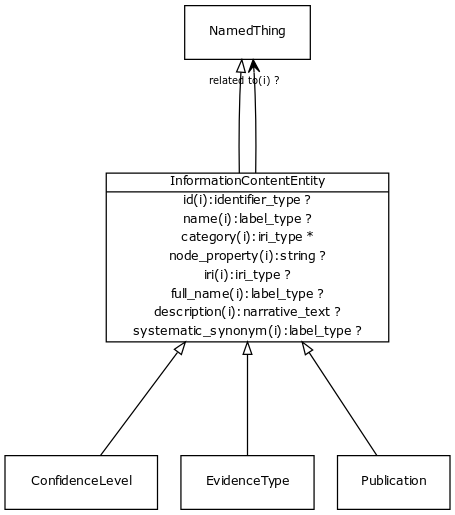

# Class: information content entity

a piece of information that typically describes some piece of biology or is used as support.

URI: [http://bioentity.io/vocab/InformationContentEntity](http://bioentity.io/vocab/InformationContentEntity)

## Mappings

 * [IAO:0000030](http://purl.obolibrary.org/obo/IAO_0000030)
 * [UMLSSG:CONC](http://purl.obolibrary.org/obo/UMLSSG_CONC)
## Inheritance

 *  is_a: [NamedThing](NamedThing.md) - a databased entity or concept/class
## Children

 * [Association](Association.md) - A typed association between two entities, supported by evidence
 * [ConfidenceLevel](ConfidenceLevel.md) - Level of confidence in a statement
 * [EvidenceType](EvidenceType.md) - Class of evidence that supports an association
 * [Publication](Publication.md) - Any published piece of information. Can refer to a whole publication, or to a part of it (e.g. a figure, figure legend, or section highlighted by NLP). The scope is intended to be general and include information published on the web as well as journals.
## Used in

## Fields

 * [category](category.md) *subsets*: (translator_minimal)
    * Description: Name of the high level ontology class in which this entity is categorized. Corresponds to the label for the biolink entity type class. In a neo4j database this MAY correspond to the neo4j label tag
    * range: [LabelType](LabelType.md)
    * inherited from: [NamedThing](NamedThing.md)
 * [description](description.md) *subsets*: (translator_minimal)
    * Description: a human-readable description of a thing
    * range: [NarrativeText](NarrativeText.md)
    * inherited from: [NamedThing](NamedThing.md)
 * [full name](full_name.md)
    * Description: a long-form human readable name for a thing
    * range: [LabelType](LabelType.md)
    * inherited from: [NamedThing](NamedThing.md)
 * [id](id.md) *subsets*: (translator_minimal)
    * Description: A unique identifier for a thing. Must be either a CURIE shorthand for a URI or a complete URI
    * range: [IdentifierType](IdentifierType.md)
    * inherited from: [NamedThing](NamedThing.md)
 * [iri](iri.md) *subsets*: (translator_minimal)
    * Description: An IRI for the node. This is determined by the id using expansion rules.
    * range: [IriType](IriType.md)
    * inherited from: [NamedThing](NamedThing.md)
 * [name](name.md) *subsets*: (translator_minimal)
    * Description: A human-readable name for a thing
    * range: [LabelType](LabelType.md)
    * inherited from: [NamedThing](NamedThing.md)
 * [node property](node_property.md)
    * Description: A grouping for any property that holds between a node and a value
    * range: **string**
    * inherited from: [NamedThing](NamedThing.md)
 * [related to](related_to.md)
    * Description: A grouping for any relationship type that holds between any two things
    * range: [NamedThing](NamedThing.md)
    * inherited from: [NamedThing](NamedThing.md)
 * [systematic synonym](systematic_synonym.md)
    * Description: more commonly used for gene symbols in yeast
    * range: [LabelType](LabelType.md)
    * inherited from: [NamedThing](NamedThing.md)
