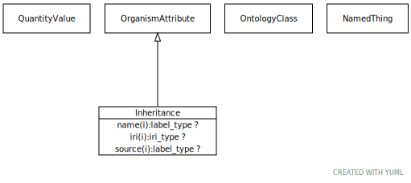

# Type: inheritance

The pattern in which a particular genetic trait or disorder is passed from one generation to the next

URI: [biolink:Inheritance](https://w3id.org/biolink/vocab/Inheritance)

## Parents

 *  is_a: [Attribute](Attribute.md) - A property or characteristic of an entity. For example, an apple may have properties such as color, shape, age, crispiness. An environmental sample may have attributes such as depth, lat, long, material.

## Attributes

### Inherited from attribute:

 * [has attribute type](has_attribute_type.md)  OPT
    * Description: connects an attribute to a class that describes it
    * range: [OntologyClass](OntologyClass.md)
    * in subsets: (samples)
 * [has qualitative value](has_qualitative_value.md)  OPT
    * Description: connects an attribute to a value
    * range: [NamedThing](NamedThing.md)
    * in subsets: (samples)
 * [has quantitative value](has_quantitative_value.md)  0..*
    * Description: connects an attribute to a value
    * range: [QuantityValue](QuantityValue.md)
    * in subsets: (samples)

## Other properties

|  |  |  |
| --- | --- | --- |
| **Mappings:** | | HP:0000005 |
|  | | GENO:0000141 |
|  | | NCIT:C45827 |

