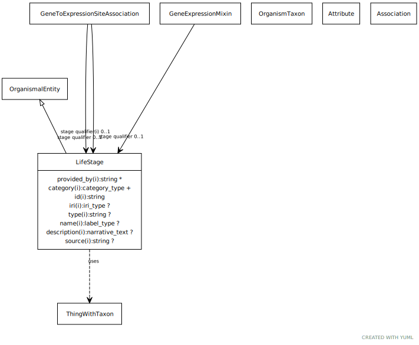

# Type: life stage

A stage of development or growth of an organism, including post-natal adult stages

URI: [biolink:LifeStage](https://w3id.org/biolink/vocab/LifeStage)

## Parents

 *  is_a: [OrganismalEntity](OrganismalEntity.md) - A named entity that is either a part of an organism, a whole organism, population or clade of organisms, excluding molecular entities

## Uses Mixins

 *  mixin: [ThingWithTaxon](ThingWithTaxon.md) - A mixin that can be used on any entity with a taxon

## Referenced by class

 *  **[GeneToExpressionSiteAssociation](GeneToExpressionSiteAssociation.md)** *[gene to expression site association➞stage qualifier](gene_to_expression_site_association_stage_qualifier.md)*  OPT  **[LifeStage](LifeStage.md)**
 *  **[Association](Association.md)** *[stage qualifier](stage_qualifier.md)*  OPT  **[LifeStage](LifeStage.md)**

## Attributes

### Inherited from organismal entity:

 * [category](category.md)  1..*
    * Description: Name of the high level ontology class in which this entity is categorized. Corresponds to the label for the biolink entity type class. In a neo4j database this MAY correspond to the neo4j label tag
    * range: [CategoryType](types/CategoryType.md)
    * in subsets: (translator_minimal)
 * [id](id.md)  REQ
    * Description: A unique identifier for a thing. Must be either a CURIE shorthand for a URI or a complete URI
    * range: [String](types/String.md)
    * in subsets: (translator_minimal)
 * [name](name.md)  REQ
    * Description: A human-readable name for a thing
    * range: [LabelType](types/LabelType.md)
    * in subsets: (translator_minimal)

### Mixed in from thing with taxon:

 * [in taxon](in_taxon.md)  0..*
    * Description: connects a thing to a class representing a taxon
    * range: [OrganismTaxon](OrganismTaxon.md)
    * in subsets: (translator_minimal)
