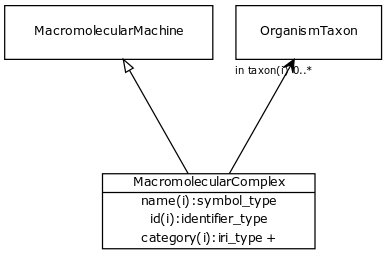

# Class: macromolecular complex

URI: [http://bioentity.io/vocab/MacromolecularComplex](http://bioentity.io/vocab/MacromolecularComplex)

## Mappings

 * [SIO:010046](http://semanticscience.org/resource/SIO_010046)
 * [WD:Q22325163](http://purl.obolibrary.org/obo/WD_Q22325163)
 * [GO:0032991](http://purl.obolibrary.org/obo/GO_0032991)
## Inheritance

 *  is_a: [macromolecular machine](MacromolecularMachine.md) - A union of gene, gene product, and macromolecular complex. These are the basic units of function in a cell. They either carry out individual biological activities, or they encode molecules which do this.
## Children

## Used in

 *  class: [macromolecular complex](MacromolecularComplex.md) references: [macromolecular machine](MacromolecularMachine.md)
## Fields

 * _[related to](related_to.md)_
    * _A grouping for any relationship type that holds between any two things_
    * range: [named thing](NamedThing.md)
    * inherited from: [named thing](NamedThing.md)
 * _[molecularly interacts with](molecularly_interacts_with.md) *subsets: translator_minimal*_
    * range: [molecular entity](MolecularEntity.md)
    * inherited from: [molecular entity](MolecularEntity.md)
 * _[regulates, entity to entity](regulates_entity_to_entity.md) *subsets: translator_minimal*_
    * range: [molecular entity](MolecularEntity.md)
    * inherited from: [molecular entity](MolecularEntity.md)
 * _[biomarker for](biomarker_for.md) *subsets: translator_minimal*_
    * _holds between a measurable molecular entity and a disease or phenotypic feature, where the entity is used as an indicator of the presence or state of the disease or feature._
    * range: [disease or phenotypic feature](DiseaseOrPhenotypicFeature.md)
    * inherited from: [molecular entity](MolecularEntity.md)
 * _[in taxon](in_taxon.md) *subsets: translator_minimal*_
    * _connects a thing to a class representing a taxon_
    * range: [organism taxon](OrganismTaxon.md)
    * inherited from: [thing with taxon](ThingWithTaxon.md)
