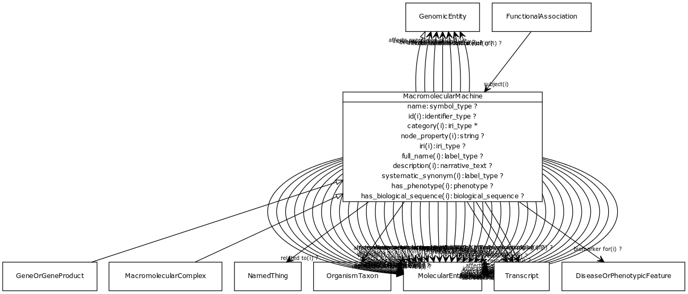

# Class: macromolecular machine

A union of gene, gene product, and macromolecular complex. These are the basic units of function in a cell. They either carry out individual biological activities, or they encode molecules which do this.

URI: [http://bioentity.io/vocab/MacromolecularMachine](http://bioentity.io/vocab/MacromolecularMachine)

## Mappings

## Inheritance

 *  is_a: [genomic entity](GenomicEntity.md) - an entity that can either be directly located on a genome (gene, transcript, exon, regulatory region) or is encoded in a genome (protein)
## Children

 *  child: [gene or gene product](GeneOrGeneProduct.md) - a union of genes or gene products. Frequently an identifier for one will be used as proxy for another
 *  child: [macromolecular complex](MacromolecularComplex.md)
## Used in

 *  class: [macromolecular machine](MacromolecularMachine.md) references: [gene or gene product](GeneOrGeneProduct.md)
 *  class: [macromolecular machine](MacromolecularMachine.md) references: [macromolecular complex](MacromolecularComplex.md)
## Fields

 * _[name](name.md) *subsets: translator_minimal*_
    * _A human-readable name for a thing_
    * range: [label type](LabelType.md)
    * __Local__
 * _[related to](related_to.md)_
    * _A grouping for any relationship type that holds between any two things_
    * range: [named thing](NamedThing.md)
    * inherited from: [named thing](NamedThing.md)
 * _[molecularly interacts with](molecularly_interacts_with.md) *subsets: translator_minimal*_
    * range: [molecular entity](MolecularEntity.md)
    * inherited from: [molecular entity](MolecularEntity.md)
 * _[regulates, entity to entity](regulates_entity_to_entity.md) *subsets: translator_minimal*_
    * range: [molecular entity](MolecularEntity.md)
    * inherited from: [molecular entity](MolecularEntity.md)
 * _[biomarker for](biomarker_for.md) *subsets: translator_minimal*_
    * _holds between a measurable molecular entity and a disease or phenotypic feature, where the entity is used as an indicator of the presence or state of the disease or feature._
    * range: [disease or phenotypic feature](DiseaseOrPhenotypicFeature.md)
    * inherited from: [molecular entity](MolecularEntity.md)
 * _[in taxon](in_taxon.md) *subsets: translator_minimal*_
    * _connects a thing to a class representing a taxon_
    * range: [organism taxon](OrganismTaxon.md)
    * inherited from: [thing with taxon](ThingWithTaxon.md)
