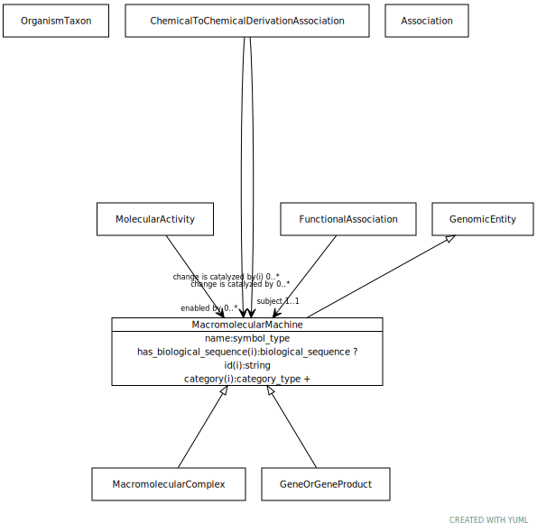

# Type: macromolecular machine

A union of gene, gene product, and macromolecular complex. These are the basic units of function in a cell. They either carry out individual biological activities, or they encode molecules which do this.

URI: [biolink:MacromolecularMachine](https://w3id.org/biolink/vocab/MacromolecularMachine)

## Parents

 *  is_a: [GenomicEntity](GenomicEntity.md) - an entity that can either be directly located on a genome (gene, transcript, exon, regulatory region) or is encoded in a genome (protein)

## Children

 * [GeneOrGeneProduct](GeneOrGeneProduct.md) - a union of genes or gene products. Frequently an identifier for one will be used as proxy for another
 * [MacromolecularComplex](MacromolecularComplex.md)

## Referenced by class

 *  **[Association](Association.md)** *[change is catalyzed by](change_is_catalyzed_by.md)*  0..*  **[MacromolecularMachine](MacromolecularMachine.md)**
 *  **[ChemicalToChemicalDerivationAssociation](ChemicalToChemicalDerivationAssociation.md)** *[chemical to chemical derivation association➞change is catalyzed by](chemical_to_chemical_derivation_association_change_is_catalyzed_by.md)*  0..*  **[MacromolecularMachine](MacromolecularMachine.md)**
 *  **[FunctionalAssociation](FunctionalAssociation.md)** *[functional association➞subject](functional_association_subject.md)*  REQ  **[MacromolecularMachine](MacromolecularMachine.md)**
 *  **[MolecularActivity](MolecularActivity.md)** *[molecular activity➞enabled by](molecular_activity_enabled_by.md)*  0..*  **[MacromolecularMachine](MacromolecularMachine.md)**

## Attributes

### Own

 * [macromolecular machine➞name](macromolecular_machine_name.md)  REQ
    * Description: genes are typically designated by a short symbol and a full name. We map the symbol to the default display name and use an additional slot for full name
    * range: [SymbolType](types/SymbolType.md)

### Inherited from genomic entity:

 * [category](category.md)  1..*
    * Description: Name of the high level ontology class in which this entity is categorized. Corresponds to the label for the biolink entity type class. In a neo4j database this MAY correspond to the neo4j label tag
    * range: [CategoryType](types/CategoryType.md)
    * in subsets: (translator_minimal)
 * [has biological sequence](has_biological_sequence.md)  OPT
    * Description: connects a genomic feature to its sequence
    * range: [BiologicalSequence](types/BiologicalSequence.md)
 * [id](id.md)  REQ
    * Description: A unique identifier for a thing. Must be either a CURIE shorthand for a URI or a complete URI
    * range: [String](types/String.md)
    * in subsets: (translator_minimal)
