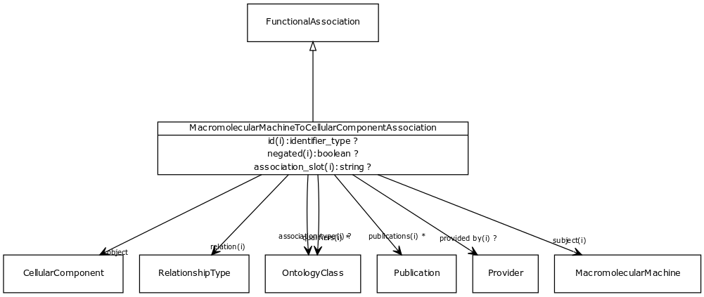

# Class: macromolecular machine to cellular component association

A functional association between a macromolecular machine (gene, gene product or complex) and a cellular component (as represented in the GO cellular component branch), where the entity carries out its function in the cellular component

URI: [http://bioentity.io/vocab/MacromolecularMachineToCellularComponentAssociation](http://bioentity.io/vocab/MacromolecularMachineToCellularComponentAssociation)

## Mappings

## Inheritance

 *  is_a: [functional association](FunctionalAssociation.md) - An association between a macromolecular machine (gene, gene product or complex of gene products) and either a molecular activity, a biological process or a cellular location in which a function is executed
## Children

## Used in

## Fields

 * _[object](object.md)_
    * _connects an association to the object of the association. For example, in a gene-to-phenotype association, the gene is subject and phenotype is object._
    * range: [cellular component](CellularComponent.md) [required]
    * __Local__
 * _[related to](related_to.md)_
    * _A grouping for any relationship type that holds between any two things_
    * range: [named thing](NamedThing.md)
    * inherited from: [named thing](NamedThing.md)
 * _[association type](association_type.md)_
    * _connects an association to the type of association (e.g. gene to phenotype)_
    * range: [ontology class](OntologyClass.md)
    * inherited from: None
 * _[relation](relation.md)_
    * _the relationship type by which a subject is connected to an object in an association_
    * range: [relationship type](RelationshipType.md) [required]
    * inherited from: None
 * _[qualifiers](qualifiers.md)_
    * _connects an association to qualifiers that modify or qualify the meaning of that association_
    * range: [ontology class](OntologyClass.md)*
    * inherited from: None
 * _[publications](publications.md)_
    * _connects an association to publications supporting the association_
    * range: [publication](Publication.md)*
    * inherited from: None
 * _[provided by](provided_by.md)_
    * _connects an association to the agent (person, organization or group) that provided it_
    * range: [provider](Provider.md)
    * inherited from: None
 * _[subject](subject.md)_
    * _connects an association to the subject of the association. For example, in a gene-to-phenotype association, the gene is subject and phenotype is object._
    * range: [macromolecular machine](MacromolecularMachine.md) [required]
    * Example: [ZFIN:ZDB-GENE-050417-357](http://purl.obolibrary.org/obo/ZFIN_ZDB-GENE-050417-357) twist1b
    * inherited from: [functional association](FunctionalAssociation.md)
