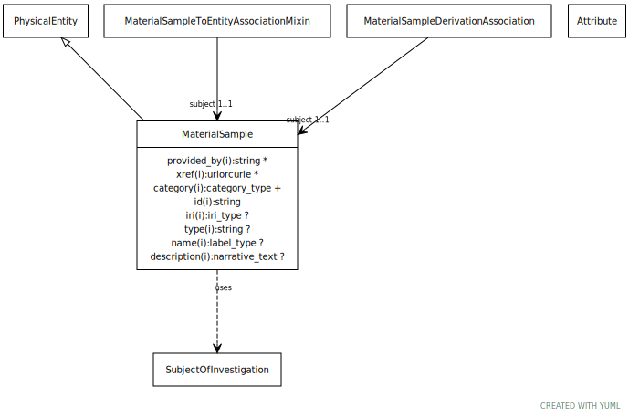

# Type: material sample

A sample is a limited quantity of something (e.g. an individual or set of individuals from a population, or a portion of a substance) to be used for testing, analysis, inspection, investigation, demonstration, or trial use. [SIO]

URI: [biolink:MaterialSample](https://w3id.org/biolink/vocab/MaterialSample)

## Parents

 *  is_a: [NamedThing](NamedThing.md) - a databased entity or concept/class

## Uses Mixins

 *  mixin: [SubjectOfInvestigation](SubjectOfInvestigation.md) - An entity that has the role of being studied in an investigation, study, or experiment
 *  mixin: [PhysicalEntity](PhysicalEntity.md) - An entity that has physical properties such as mass, volume, or charge

## Referenced by class

 *  **[MaterialSampleDerivationAssociation](MaterialSampleDerivationAssociation.md)** *[material sample derivation association➞subject](material_sample_derivation_association_subject.md)*  REQ  **[MaterialSample](MaterialSample.md)**
 *  **[MaterialSampleToThingAssociation](MaterialSampleToThingAssociation.md)** *[material sample to thing association➞subject](material_sample_to_thing_association_subject.md)*  REQ  **[MaterialSample](MaterialSample.md)**

## Attributes

### Own

 * [has attribute](has_attribute.md)  0..*
    * Description: connects any named thing to an attribute
    * range: [Attribute](Attribute.md)
    * in subsets: (samples)

### Inherited from named thing:

 * [category](category.md)  1..*
    * Description: Name of the high level ontology class in which this entity is categorized. Corresponds to the label for the biolink entity type class. In a neo4j database this MAY correspond to the neo4j label tag
    * range: [CategoryType](types/CategoryType.md)
    * in subsets: (translator_minimal)
 * [id](id.md)  REQ
    * Description: A unique identifier for a thing. Must be either a CURIE shorthand for a URI or a complete URI
    * range: [String](types/String.md)
    * in subsets: (translator_minimal)
 * [name](name.md)  REQ
    * Description: A human-readable name for a thing
    * range: [LabelType](types/LabelType.md)
    * in subsets: (translator_minimal)

## Other properties

|  |  |  |
| --- | --- | --- |
| **Aliases:** | | biospecimen |
|  | | sample |
|  | | biosample |
|  | | physical sample |
| **Mappings:** | | OBI:0000747 |
|  | | SIO:001050 |

