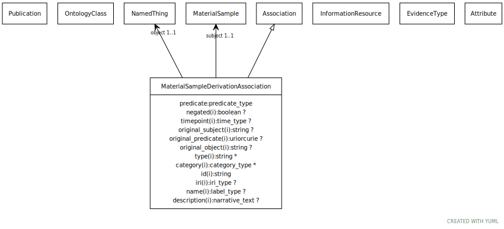

# Type: material sample derivation association

An association between a material sample and the material entity it is derived from

URI: [biolink:MaterialSampleDerivationAssociation](https://w3id.org/biolink/vocab/MaterialSampleDerivationAssociation)

## Parents

 *  is_a: [Association](Association.md) - A typed association between two entities, supported by evidence

## Referenced by class

## Attributes

### Own

 * [material sample derivation association➞object](material_sample_derivation_association_object.md)  REQ
    * Description: the material entity the sample was derived from. This may be another material sample, or any other material entity, including for example an organism, a geographic feature, or some environmental material.
    * range: [NamedThing](NamedThing.md)
 * [material sample derivation association➞relation](material_sample_derivation_association_relation.md)  REQ
    * Description: derivation relationship
    * range: [Uriorcurie](types/Uriorcurie.md)
 * [material sample derivation association➞subject](material_sample_derivation_association_subject.md)  REQ
    * Description: the material sample being described
    * range: [MaterialSample](MaterialSample.md)

### Inherited from association:

 * [association type](association_type.md)  OPT
    * Description: connects an association to the type of association (e.g. gene to phenotype)
    * range: [OntologyClass](OntologyClass.md)
 * [association➞id](association_id.md)  REQ
    * Description: A unique identifier for an association
    * range: [String](types/String.md)
    * in subsets: (translator_minimal)
 * [negated](negated.md)  OPT
    * Description: if set to true, then the association is negated i.e. is not true
    * range: [Boolean](types/Boolean.md)
 * [provided by](provided_by.md)  0..*
    * Description: connects an association to the agent (person, organization or group) that provided it
    * range: [Provider](Provider.md)
 * [publications](publications.md)  0..*
    * Description: connects an association to publications supporting the association
    * range: [Publication](Publication.md)
 * [qualifiers](qualifiers.md)  0..*
    * Description: connects an association to qualifiers that modify or qualify the meaning of that association
    * range: [OntologyClass](OntologyClass.md)
