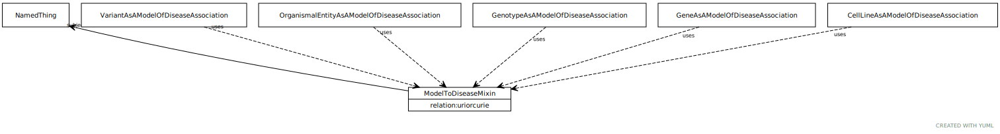

# Type: model to disease mixin

This mixin is used for any association class for which the subject (source node) plays the role of a 'model', in that it recapitulates some features of the disease in a way that is useful for studying the disease outside a patient carrying the disease

URI: [biolink:ModelToDiseaseMixin](https://w3id.org/biolink/vocab/ModelToDiseaseMixin)

## Mixin for

 * [CellLineAsAModelOfDiseaseAssociation](CellLineAsAModelOfDiseaseAssociation.md) (mixin) 
 * [GeneAsAModelOfDiseaseAssociation](GeneAsAModelOfDiseaseAssociation.md) (mixin) 
 * [GenotypeAsAModelOfDiseaseAssociation](GenotypeAsAModelOfDiseaseAssociation.md) (mixin) 
 * [OrganismalEntityAsAModelOfDiseaseAssociation](OrganismalEntityAsAModelOfDiseaseAssociation.md) (mixin) 
 * [VariantAsAModelOfDiseaseAssociation](VariantAsAModelOfDiseaseAssociation.md) (mixin) 

## Referenced by class

## Attributes

### Own

 * [model to disease mixin➞relation](model_to_disease_mixin_relation.md)  REQ
    * Description: The relationship to the disease
    * range: [Uriorcurie](types/Uriorcurie.md)
 * [model to disease mixin➞subject](model_to_disease_mixin_subject.md)  REQ
    * Description: The entity that serves as the model of the disease. This may be an organism, a strain of organism, a genotype or variant that exhibits similar features, or a gene that when mutated exhibits features of the disease
    * range: [NamedThing](NamedThing.md)
