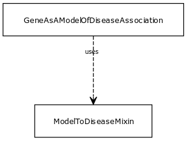

# Class: model to disease mixin

This mixin is used for any association class for which the subject (source node) plays the role of a 'model', in that it recapitulates some features of the disease in a way that is useful for studying the disease outside a patient carrying the disease

URI: [biolink:ModelToDiseaseMixin](https://w3id.org/biolink/vocab/ModelToDiseaseMixin)

## Mixin for

 * [GeneAsAModelOfDiseaseAssociation](GeneAsAModelOfDiseaseAssociation.md) (mixin) 

## Referenced by class

## Attributes

### Domain for slot:

 * [relation](model_to_disease_mixin_relation.md)  REQ
    * range: [Uriorcurie](Uriorcurie.md)
 * [subject](model_to_disease_mixin_subject.md)  REQ
    * range: [NamedThing](NamedThing.md)
