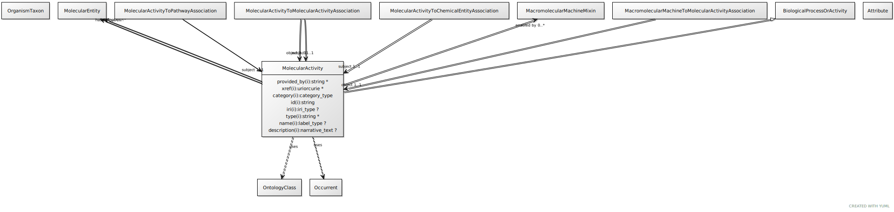

# Type: molecular activity

An execution of a molecular function carried out by a gene product or macromolecular complex.

URI: [biolink:MolecularActivity](https://w3id.org/biolink/vocab/MolecularActivity)

## Parents

 *  is_a: [BiologicalProcessOrActivity](BiologicalProcessOrActivity.md) - Either an individual molecular activity, or a collection of causally connected molecular activities

## Uses Mixins

 *  mixin: [Occurrent](Occurrent.md) - A processual entity

## Referenced by class

 *  **[MacromolecularMachineToMolecularActivityAssociation](MacromolecularMachineToMolecularActivityAssociation.md)** *[macromolecular machine to molecular activity association➞object](macromolecular_machine_to_molecular_activity_association_object.md)*  REQ  **[MolecularActivity](MolecularActivity.md)**

## Attributes

### Own

 * [molecular activity➞enabled by](molecular_activity_enabled_by.md)  0..*
    * Description: The gene product, gene, or complex that catalyzes the reaction
    * range: [MacromolecularMachine](MacromolecularMachine.md)
 * [molecular activity➞has input](molecular_activity_has_input.md)  0..*
    * Description: A chemical entity that is the input for the reaction
    * range: [ChemicalSubstance](ChemicalSubstance.md)
 * [molecular activity➞has output](molecular_activity_has_output.md)  0..*
    * Description: A chemical entity that is the output for the reaction
    * range: [ChemicalSubstance](ChemicalSubstance.md)

### Inherited from biological process or activity:

 * [category](category.md)  1..*
    * Description: Name of the high level ontology class in which this entity is categorized. Corresponds to the label for the biolink entity type class. In a neo4j database this MAY correspond to the neo4j label tag
    * range: [CategoryType](types/CategoryType.md)
    * in subsets: (translator_minimal)
 * [id](id.md)  REQ
    * Description: A unique identifier for a thing. Must be either a CURIE shorthand for a URI or a complete URI
    * range: [String](types/String.md)
    * in subsets: (translator_minimal)
 * [name](name.md)  REQ
    * Description: A human-readable name for a thing
    * range: [LabelType](types/LabelType.md)
    * in subsets: (translator_minimal)

## Other properties

|  |  |  |
| --- | --- | --- |
| **Aliases:** | | molecular function |
|  | | molecular event |
|  | | reaction |
| **Mappings:** | | GO:0003674 |
|  | | UMLSSC:T044 |
|  | | UMLSST:moft |

