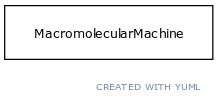

# Class: molecular activity

An execution of a molecular function carried out by a gene product or macromolecular complex.

URI: [http://bioentity.io/vocab/MolecularActivity](http://bioentity.io/vocab/MolecularActivity)

## Mappings

 * [GO:0003674](http://purl.obolibrary.org/obo/GO_0003674)
## Inheritance

 *  is_a: [biological process or activity](BiologicalProcessOrActivity.md) - Either an individual molecular activity, or a collection of causally connected molecular activities
 *  mixin: [occurrent](Occurrent.md) - A processual entity
## Children

## Used in

 *  class: [molecular activity](MolecularActivity.md) references: [biological process or activity](BiologicalProcessOrActivity.md)
## Fields

 * _[regulates, process to process](regulates_process_to_process.md)_
    * range: [occurrent](Occurrent.md)
    * __Local__
 * _[has participant](has_participant.md) *subsets: translator_minimal*_
    * _holds between a process and a continuant, where the continuant is somehow involved in the process _
    * range: string
    * __Local__
 * _[has input](has_input.md) *subsets: translator_minimal*_
    * _holds between a process and a continuant, where the continuant is an input into the process_
    * range: string
    * __Local__
 * _[precedes](precedes.md) *subsets: translator_minimal*_
    * _holds between two processes, where one completes before the other begins_
    * range: [occurrent](Occurrent.md)
    * __Local__
 * _[related to](related_to.md)_
    * _A grouping for any relationship type that holds between any two things_
    * range: [named thing](NamedThing.md)
    * inherited from: [named thing](NamedThing.md)
