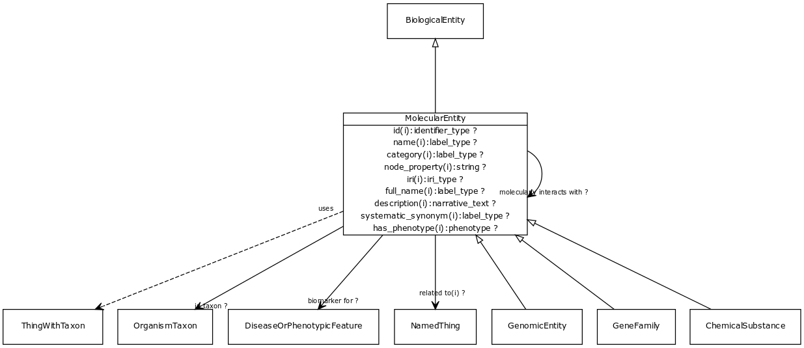

# Class: molecular entity

A gene, gene product, small molecule or macromolecule (including protein complex)

URI: [http://bioentity.io/vocab/MolecularEntity](http://bioentity.io/vocab/MolecularEntity)

## Mappings

 * [SIO:010004](http://semanticscience.org/resource/SIO_010004)
 * [WD:Q43460564](http://purl.obolibrary.org/obo/WD_Q43460564)
## Inheritance

 *  is_a: [BiologicalEntity](BiologicalEntity.md)
 *  mixin: [ThingWithTaxon](ThingWithTaxon.md) - A mixin that can be used on any entity with a taxon
## Children

 * [ChemicalSubstance](ChemicalSubstance.md) - May be a chemical entity or a formulation with a chemical entity as active ingredient, or a complex material with multiple chemical entities as part
 * [GeneFamily](GeneFamily.md) - any grouping of multiple genes or gene products related by common descent
 * [GenomicEntity](GenomicEntity.md) - an entity that can either be directly located on a genome (gene, transcript, exon, regulatory region) or is encoded in a genome (protein)
## Used in

 *  class: **[DiseaseOrPhenotypicFeature](DiseaseOrPhenotypicFeature.md)** *[correlated with](correlated_with.md)* **[MolecularEntity](MolecularEntity.md)**
 *  class: **[GeneToGoTermAssociation](GeneToGoTermAssociation.md)** *[gene to go term association.subject](gene_to_go_term_association_subject.md)* **[MolecularEntity](MolecularEntity.md)**
 *  class: **[DiseaseOrPhenotypicFeature](DiseaseOrPhenotypicFeature.md)** *[has biomarker](has_biomarker.md)* **[MolecularEntity](MolecularEntity.md)**
 *  class: **[MolecularEntity](MolecularEntity.md)** *[molecularly interacts with](molecularly_interacts_with.md)* **[MolecularEntity](MolecularEntity.md)**
 *  class: **[PairwiseInteractionAssociation](PairwiseInteractionAssociation.md)** *[pairwise interaction association.object](pairwise_interaction_association_object.md)* **[MolecularEntity](MolecularEntity.md)**
 *  class: **[PairwiseInteractionAssociation](PairwiseInteractionAssociation.md)** *[pairwise interaction association.subject](pairwise_interaction_association_subject.md)* **[MolecularEntity](MolecularEntity.md)**
 *  class: **[MolecularEntity](MolecularEntity.md)** *[regulates, entity to entity](regulates_entity_to_entity.md)* **[MolecularEntity](MolecularEntity.md)**
## Fields

 * [biomarker for](biomarker_for.md) *subsets*: (translator_minimal)
    * Description: holds between a measurable molecular entity and a disease or phenotypic feature, where the entity is used as an indicator of the presence or state of the disease or feature.
    * range: [DiseaseOrPhenotypicFeature](DiseaseOrPhenotypicFeature.md)
    * __Local__
 * [molecularly interacts with](molecularly_interacts_with.md) *subsets*: (translator_minimal)
    * Description: holds between two entities that make physical contact as part of some interaction
    * range: [MolecularEntity](MolecularEntity.md)
    * __Local__
 * [regulates, entity to entity](regulates_entity_to_entity.md) *subsets*: (translator_minimal)
    * Description: describes an entity that has a direct affect on the state or quality of another existing entity. Use of the 'affects' predicate implies that the affected entity already exists, unlike predicates such as 'affects risk for' and 'prevents, where the outcome is something that may or may not come to be.
    * range: [MolecularEntity](MolecularEntity.md)
    * __Local__
 * [category](category.md) *subsets*: (translator_minimal)
    * Description: Name of the high level ontology class in which this entity is categorized. Corresponds to the label for the biolink entity type class. In a neo4j database this MAY correspond to the neo4j label tag
    * range: [LabelType](LabelType.md)
    * inherited from: [NamedThing](NamedThing.md)
 * [description](description.md) *subsets*: (translator_minimal)
    * Description: a human-readable description of a thing
    * range: [NarrativeText](NarrativeText.md)
    * inherited from: [NamedThing](NamedThing.md)
 * [full name](full_name.md)
    * Description: a long-form human readable name for a thing
    * range: [LabelType](LabelType.md)
    * inherited from: [NamedThing](NamedThing.md)
 * [has phenotype](has_phenotype.md) *subsets*: (translator_minimal)
    * Description: holds between a biological entity and a phenotype, where a phenotype is construed broadly as any kind of quality of an organism part, a collection of these qualities, or a change in quality or qualities (e.g. abnormally increased temperature). 
    * range: [Phenotype](Phenotype.md)
    * inherited from: [BiologicalEntity](BiologicalEntity.md)
 * [id](id.md) *subsets*: (translator_minimal)
    * Description: A unique identifier for a thing. Must be either a CURIE shorthand for a URI or a complete URI
    * range: [IdentifierType](IdentifierType.md)
    * inherited from: [NamedThing](NamedThing.md)
 * [in taxon](in_taxon.md) *subsets*: (translator_minimal)
    * Description: connects a thing to a class representing a taxon
    * range: [OrganismTaxon](OrganismTaxon.md)
    * inherited from: [ThingWithTaxon](ThingWithTaxon.md)
 * [iri](iri.md) *subsets*: (translator_minimal)
    * Description: An IRI for the node. This is determined by the id using expansion rules.
    * range: [IriType](IriType.md)
    * inherited from: [NamedThing](NamedThing.md)
 * [name](name.md) *subsets*: (translator_minimal)
    * Description: A human-readable name for a thing
    * range: [LabelType](LabelType.md)
    * inherited from: [NamedThing](NamedThing.md)
 * [node property](node_property.md)
    * Description: A grouping for any property that holds between a node and a value
    * range: **string**
    * inherited from: [NamedThing](NamedThing.md)
 * [related to](related_to.md)
    * Description: A grouping for any relationship type that holds between any two things
    * range: [NamedThing](NamedThing.md)
    * inherited from: [NamedThing](NamedThing.md)
 * [systematic synonym](systematic_synonym.md)
    * Description: more commonly used for gene symbols in yeast
    * range: [LabelType](LabelType.md)
    * inherited from: [NamedThing](NamedThing.md)
