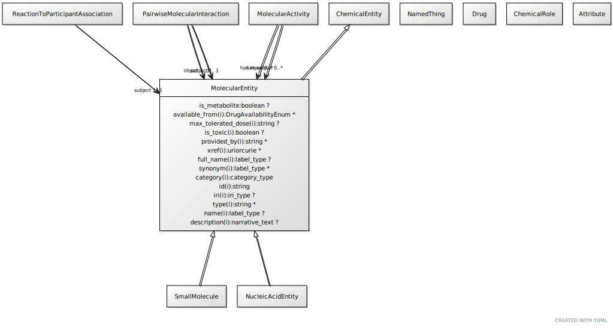

# Type: molecular entity

A gene, gene product, small molecule or macromolecule (including protein complex)

URI: [biolink:MolecularEntity](https://w3id.org/biolink/vocab/MolecularEntity)

## Parents

 *  is_a: [BiologicalEntity](BiologicalEntity.md)

## Uses Mixins

 *  mixin: [ThingWithTaxon](ThingWithTaxon.md) - A mixin that can be used on any entity with a taxon
 *  mixin: [PhysicalEntity](PhysicalEntity.md) - An entity that has physical properties such as mass, volume, or charge

## Children

 * [ChemicalSubstance](ChemicalSubstance.md) - May be a chemical entity or a formulation with a chemical entity as active ingredient, or a complex material with multiple chemical entities as part
 * [GeneFamily](GeneFamily.md) - any grouping of multiple genes or gene products related by common descent
 * [GenomicEntity](GenomicEntity.md) - an entity that can either be directly located on a genome (gene, transcript, exon, regulatory region) or is encoded in a genome (protein)

## Referenced by class

 *  **[MolecularEntity](MolecularEntity.md)** *[affects abundance of](affects_abundance_of.md)*  0..*  **[MolecularEntity](MolecularEntity.md)**
 *  **[MolecularEntity](MolecularEntity.md)** *[affects activity of](affects_activity_of.md)*  0..*  **[MolecularEntity](MolecularEntity.md)**
 *  **[MolecularEntity](MolecularEntity.md)** *[affects degradation of](affects_degradation_of.md)*  0..*  **[MolecularEntity](MolecularEntity.md)**
 *  **[MolecularEntity](MolecularEntity.md)** *[affects folding of](affects_folding_of.md)*  0..*  **[MolecularEntity](MolecularEntity.md)**
 *  **[MolecularEntity](MolecularEntity.md)** *[affects localization of](affects_localization_of.md)*  0..*  **[MolecularEntity](MolecularEntity.md)**
 *  **[MolecularEntity](MolecularEntity.md)** *[affects metabolic processing of](affects_metabolic_processing_of.md)*  0..*  **[MolecularEntity](MolecularEntity.md)**
 *  **[MolecularEntity](MolecularEntity.md)** *[affects molecular modification of](affects_molecular_modification_of.md)*  0..*  **[MolecularEntity](MolecularEntity.md)**
 *  **[MolecularEntity](MolecularEntity.md)** *[affects response to](affects_response_to.md)*  0..*  **[MolecularEntity](MolecularEntity.md)**
 *  **[MolecularEntity](MolecularEntity.md)** *[affects secretion of](affects_secretion_of.md)*  0..*  **[MolecularEntity](MolecularEntity.md)**
 *  **[MolecularEntity](MolecularEntity.md)** *[affects stability of](affects_stability_of.md)*  0..*  **[MolecularEntity](MolecularEntity.md)**
 *  **[MolecularEntity](MolecularEntity.md)** *[affects synthesis of](affects_synthesis_of.md)*  0..*  **[MolecularEntity](MolecularEntity.md)**
 *  **[MolecularEntity](MolecularEntity.md)** *[affects transport of](affects_transport_of.md)*  0..*  **[MolecularEntity](MolecularEntity.md)**
 *  **[MolecularEntity](MolecularEntity.md)** *[affects uptake of](affects_uptake_of.md)*  0..*  **[MolecularEntity](MolecularEntity.md)**
 *  **[MolecularEntity](MolecularEntity.md)** *[decreases abundance of](decreases_abundance_of.md)*  0..*  **[MolecularEntity](MolecularEntity.md)**
 *  **[MolecularEntity](MolecularEntity.md)** *[decreases activity of](decreases_activity_of.md)*  0..*  **[MolecularEntity](MolecularEntity.md)**
 *  **[MolecularEntity](MolecularEntity.md)** *[decreases degradation of](decreases_degradation_of.md)*  0..*  **[MolecularEntity](MolecularEntity.md)**
 *  **[MolecularEntity](MolecularEntity.md)** *[decreases folding of](decreases_folding_of.md)*  0..*  **[MolecularEntity](MolecularEntity.md)**
 *  **[MolecularEntity](MolecularEntity.md)** *[decreases localization of](decreases_localization_of.md)*  0..*  **[MolecularEntity](MolecularEntity.md)**
 *  **[MolecularEntity](MolecularEntity.md)** *[decreases metabolic processing of](decreases_metabolic_processing_of.md)*  0..*  **[MolecularEntity](MolecularEntity.md)**
 *  **[MolecularEntity](MolecularEntity.md)** *[decreases molecular interaction](decreases_molecular_interaction.md)*  0..*  **[MolecularEntity](MolecularEntity.md)**
 *  **[MolecularEntity](MolecularEntity.md)** *[decreases molecular modification of](decreases_molecular_modification_of.md)*  0..*  **[MolecularEntity](MolecularEntity.md)**
 *  **[MolecularEntity](MolecularEntity.md)** *[decreases response to](decreases_response_to.md)*  0..*  **[MolecularEntity](MolecularEntity.md)**
 *  **[MolecularEntity](MolecularEntity.md)** *[decreases secretion of](decreases_secretion_of.md)*  0..*  **[MolecularEntity](MolecularEntity.md)**
 *  **[MolecularEntity](MolecularEntity.md)** *[decreases stability of](decreases_stability_of.md)*  0..*  **[MolecularEntity](MolecularEntity.md)**
 *  **[MolecularEntity](MolecularEntity.md)** *[decreases synthesis of](decreases_synthesis_of.md)*  0..*  **[MolecularEntity](MolecularEntity.md)**
 *  **[MolecularEntity](MolecularEntity.md)** *[decreases transport of](decreases_transport_of.md)*  0..*  **[MolecularEntity](MolecularEntity.md)**
 *  **[MolecularEntity](MolecularEntity.md)** *[decreases uptake of](decreases_uptake_of.md)*  0..*  **[MolecularEntity](MolecularEntity.md)**
 *  **[GeneToGoTermAssociation](GeneToGoTermAssociation.md)** *[gene to go term association➞subject](gene_to_go_term_association_subject.md)*  REQ  **[MolecularEntity](MolecularEntity.md)**
 *  **[DiseaseOrPhenotypicFeature](DiseaseOrPhenotypicFeature.md)** *[has biomarker](has_biomarker.md)*  0..*  **[MolecularEntity](MolecularEntity.md)**
 *  **[MolecularEntity](MolecularEntity.md)** *[increases abundance of](increases_abundance_of.md)*  0..*  **[MolecularEntity](MolecularEntity.md)**
 *  **[MolecularEntity](MolecularEntity.md)** *[increases activity of](increases_activity_of.md)*  0..*  **[MolecularEntity](MolecularEntity.md)**
 *  **[MolecularEntity](MolecularEntity.md)** *[increases degradation of](increases_degradation_of.md)*  0..*  **[MolecularEntity](MolecularEntity.md)**
 *  **[MolecularEntity](MolecularEntity.md)** *[increases folding of](increases_folding_of.md)*  0..*  **[MolecularEntity](MolecularEntity.md)**
 *  **[MolecularEntity](MolecularEntity.md)** *[increases localization of](increases_localization_of.md)*  0..*  **[MolecularEntity](MolecularEntity.md)**
 *  **[MolecularEntity](MolecularEntity.md)** *[increases metabolic processing of](increases_metabolic_processing_of.md)*  0..*  **[MolecularEntity](MolecularEntity.md)**
 *  **[MolecularEntity](MolecularEntity.md)** *[increases molecular interaction](increases_molecular_interaction.md)*  0..*  **[MolecularEntity](MolecularEntity.md)**
 *  **[MolecularEntity](MolecularEntity.md)** *[increases molecular modification of](increases_molecular_modification_of.md)*  0..*  **[MolecularEntity](MolecularEntity.md)**
 *  **[MolecularEntity](MolecularEntity.md)** *[increases response to](increases_response_to.md)*  0..*  **[MolecularEntity](MolecularEntity.md)**
 *  **[MolecularEntity](MolecularEntity.md)** *[increases secretion of](increases_secretion_of.md)*  0..*  **[MolecularEntity](MolecularEntity.md)**
 *  **[MolecularEntity](MolecularEntity.md)** *[increases stability of](increases_stability_of.md)*  0..*  **[MolecularEntity](MolecularEntity.md)**
 *  **[MolecularEntity](MolecularEntity.md)** *[increases synthesis of](increases_synthesis_of.md)*  0..*  **[MolecularEntity](MolecularEntity.md)**
 *  **[MolecularEntity](MolecularEntity.md)** *[increases transport of](increases_transport_of.md)*  0..*  **[MolecularEntity](MolecularEntity.md)**
 *  **[MolecularEntity](MolecularEntity.md)** *[increases uptake of](increases_uptake_of.md)*  0..*  **[MolecularEntity](MolecularEntity.md)**
 *  **[MolecularEntity](MolecularEntity.md)** *[molecularly interacts with](molecularly_interacts_with.md)*  0..*  **[MolecularEntity](MolecularEntity.md)**
 *  **[MolecularEntity](MolecularEntity.md)** *[negatively regulates, entity to entity](negatively_regulates_entity_to_entity.md)*  0..*  **[MolecularEntity](MolecularEntity.md)**
 *  **[PairwiseInteractionAssociation](PairwiseInteractionAssociation.md)** *[pairwise interaction association➞object](pairwise_interaction_association_object.md)*  REQ  **[MolecularEntity](MolecularEntity.md)**
 *  **[PairwiseInteractionAssociation](PairwiseInteractionAssociation.md)** *[pairwise interaction association➞subject](pairwise_interaction_association_subject.md)*  REQ  **[MolecularEntity](MolecularEntity.md)**
 *  **[MolecularEntity](MolecularEntity.md)** *[positively regulates, entity to entity](positively_regulates_entity_to_entity.md)*  0..*  **[MolecularEntity](MolecularEntity.md)**
 *  **[MolecularEntity](MolecularEntity.md)** *[regulates, entity to entity](regulates_entity_to_entity.md)*  0..*  **[MolecularEntity](MolecularEntity.md)**

## Attributes

### Inherited from biological entity:

 * [category](category.md)  1..*
    * Description: Name of the high level ontology class in which this entity is categorized. Corresponds to the label for the biolink entity type class. In a neo4j database this MAY correspond to the neo4j label tag
    * range: [CategoryType](types/CategoryType.md)
    * in subsets: (translator_minimal)
 * [id](id.md)  REQ
    * Description: A unique identifier for a thing. Must be either a CURIE shorthand for a URI or a complete URI
    * range: [String](types/String.md)
    * in subsets: (translator_minimal)
 * [name](name.md)  REQ
    * Description: A human-readable name for a thing
    * range: [LabelType](types/LabelType.md)
    * in subsets: (translator_minimal)

### Mixed in from thing with taxon:

 * [in taxon](in_taxon.md)  0..*
    * Description: connects a thing to a class representing a taxon
    * range: [OrganismTaxon](OrganismTaxon.md)
    * in subsets: (translator_minimal)

## Other properties

|  |  |  |
| --- | --- | --- |
| **Aliases:** | | bioentity |
| **Mappings:** | | SIO:010341 |
|  | | WIKIDATA:Q43460564 |
|  | | UMLSSG:GENE |
|  | | UMLSSC:T085 |
|  | | UMLSST:mosq |

