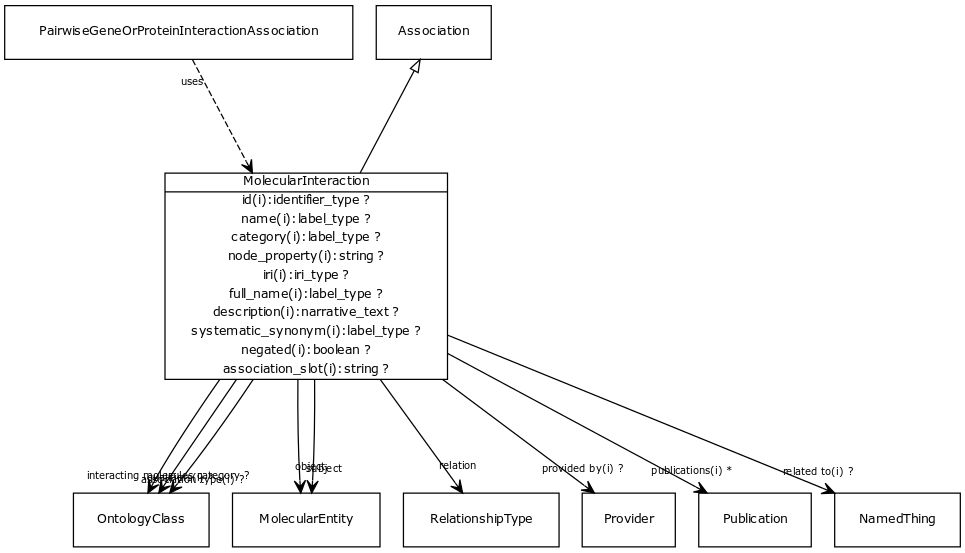

# Class: molecular interaction

An interaction at the molecular level between two physical entities

URI: [http://bioentity.io/vocab/MolecularInteraction](http://bioentity.io/vocab/MolecularInteraction)

## Mappings

## Inheritance

 *  is_a: [association](Association.md) - A typed association between two entities, supported by evidence
## Children

 *  mixin: [pairwise gene or protein interaction association](PairwiseGeneOrProteinInteractionAssociation.md) - An interaction between two genes or two gene products. May be physical (e.g. protein binding) or genetic (between genes). May be symmetric (e.g. protein interaction) or directed (e.g. phosphorylation)
## Used in

 *  class: [molecular interaction](MolecularInteraction.md) references: [pairwise gene or protein interaction association](PairwiseGeneOrProteinInteractionAssociation.md)
## Fields

 * _[subject](subject.md)_
    * _connects an association to the subject of the association. For example, in a gene-to-phenotype association, the gene is subject and phenotype is object._
    * range: [molecular entity](MolecularEntity.md) [required]
    * __Local__
 * _[relation](relation.md)_
    * _the relationship type by which a subject is connected to an object in an association_
    * range: [relationship type](RelationshipType.md) [required]
    * edge label: [molecularly interacts with](molecularly_interacts_with.md) *subsets: translator_minimal*
    * Example: [RO:0002447](http://purl.obolibrary.org/obo/RO_0002447) the subject molecular phosphorylates the object molecule
    * __Local__
 * _[object](object.md)_
    * _connects an association to the object of the association. For example, in a gene-to-phenotype association, the gene is subject and phenotype is object._
    * range: [molecular entity](MolecularEntity.md) [required]
    * __Local__
 * _[interacting molecules category](interacting_molecules_category.md)_
    * range: [ontology class](OntologyClass.md)
    * Example: [MI:1048](http://purl.obolibrary.org/obo/MI_1048) smallmolecule-protein
    * __Local__
 * _[related to](related_to.md)_
    * _A grouping for any relationship type that holds between any two things_
    * range: [named thing](NamedThing.md)
    * inherited from: [named thing](NamedThing.md)
 * _[association type](association_type.md)_
    * _connects an association to the type of association (e.g. gene to phenotype)_
    * range: [ontology class](OntologyClass.md)
    * inherited from: None
 * _[qualifiers](qualifiers.md)_
    * _connects an association to qualifiers that modify or qualify the meaning of that association_
    * range: [ontology class](OntologyClass.md)*
    * inherited from: None
 * _[publications](publications.md)_
    * _connects an association to publications supporting the association_
    * range: [publication](Publication.md)*
    * inherited from: None
 * _[provided by](provided_by.md)_
    * _connects an association to the agent (person, organization or group) that provided it_
    * range: [provider](Provider.md)
    * inherited from: None
