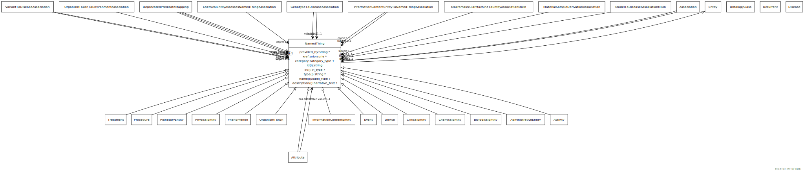

# Type: named thing

a databased entity or concept/class

URI: [biolink:NamedThing](https://w3id.org/biolink/vocab/NamedThing)

## Children

 * [AdministrativeEntity](AdministrativeEntity.md)
 * [BiologicalEntity](BiologicalEntity.md)
 * [ClinicalEntity](ClinicalEntity.md) - Any entity or process that exists in the clinical domain and outside the biological realm. Diseases are placed under biological entities
 * [DataFile](DataFile.md)
 * [DataSet](DataSet.md)
 * [Device](Device.md) - A thing made or adapted for a particular purpose, especially a piece of mechanical or electronic equipment
 * [InformationContentEntity](InformationContentEntity.md) - a piece of information that typically describes some piece of biology or is used as support.
 * [MaterialSample](MaterialSample.md) - A sample is a limited quantity of something (e.g. an individual or set of individuals from a population, or a portion of a substance) to be used for testing, analysis, inspection, investigation, demonstration, or trial use. [SIO]
 * [Occurrent](Occurrent.md) - A processual entity
 * [OntologyClass](OntologyClass.md) - a concept or class in an ontology, vocabulary or thesaurus
 * [PhysicalEntity](PhysicalEntity.md) - An entity that has physical properties such as mass, volume, or charge
 * [PlanetaryEntity](PlanetaryEntity.md) - Any entity or process that exists at the level of the whole planet

## Referenced by class

 *  **[NamedThing](NamedThing.md)** *[affects](affects.md)*  0..*  **[NamedThing](NamedThing.md)**
 *  **[NamedThing](NamedThing.md)** *[affects expression in](affects_expression_in.md)*  0..*  **[NamedThing](NamedThing.md)**
 *  **[NamedThing](NamedThing.md)** *[affects risk for](affects_risk_for.md)*  0..*  **[NamedThing](NamedThing.md)**
 *  **[NamedThing](NamedThing.md)** *[caused by](caused_by.md)*  0..*  **[NamedThing](NamedThing.md)**
 *  **[NamedThing](NamedThing.md)** *[causes](causes.md)*  0..*  **[NamedThing](NamedThing.md)**
 *  **[NamedThing](NamedThing.md)** *[chemically similar to](chemically_similar_to.md)*  0..*  **[NamedThing](NamedThing.md)**
 *  **[NamedThing](NamedThing.md)** *[close match](close_match.md)*  0..*  **[NamedThing](NamedThing.md)**
 *  **[NamedThing](NamedThing.md)** *[coexists with](coexists_with.md)*  0..*  **[NamedThing](NamedThing.md)**
 *  **[NamedThing](NamedThing.md)** *[colocalizes with](colocalizes_with.md)*  0..*  **[NamedThing](NamedThing.md)**
 *  **[NamedThing](NamedThing.md)** *[contributes to](contributes_to.md)*  0..*  **[NamedThing](NamedThing.md)**
 *  **[NamedThing](NamedThing.md)** *[correlated with](correlated_with.md)*  0..*  **[NamedThing](NamedThing.md)**
 *  **[NamedThing](NamedThing.md)** *[derives from](derives_from.md)*  0..*  **[NamedThing](NamedThing.md)**
 *  **[NamedThing](NamedThing.md)** *[derives into](derives_into.md)*  0..*  **[NamedThing](NamedThing.md)**
 *  **[NamedThing](NamedThing.md)** *[develops from](develops_from.md)*  0..*  **[NamedThing](NamedThing.md)**
 *  **[NamedThing](NamedThing.md)** *[directly interacts with](directly_interacts_with.md)*  0..*  **[NamedThing](NamedThing.md)**
 *  **[NamedThing](NamedThing.md)** *[disease has basis in](disease_has_basis_in.md)*  0..*  **[NamedThing](NamedThing.md)**
 *  **[NamedThing](NamedThing.md)** *[disrupts](disrupts.md)*  0..*  **[NamedThing](NamedThing.md)**
 *  **[BiologicalProcessOrActivity](BiologicalProcessOrActivity.md)** *[enabled by](enabled_by.md)*  0..*  **[NamedThing](NamedThing.md)**
 *  **[NamedThing](NamedThing.md)** *[filler](filler.md)*  OPT  **[NamedThing](NamedThing.md)**
 *  **[GenotypeToDiseaseAssociation](GenotypeToDiseaseAssociation.md)** *[genotype to disease association➞object](genotype_to_disease_association_object.md)*  REQ  **[NamedThing](NamedThing.md)**
 *  **[GenotypeToDiseaseAssociation](GenotypeToDiseaseAssociation.md)** *[genotype to disease association➞subject](genotype_to_disease_association_subject.md)*  REQ  **[NamedThing](NamedThing.md)**
 *  **[NamedThing](NamedThing.md)** *[has completed](has_completed.md)*  0..*  **[NamedThing](NamedThing.md)**
 *  **[NamedThing](NamedThing.md)** *[has decreased amount](has_decreased_amount.md)*  0..*  **[NamedThing](NamedThing.md)**
 *  **[NamedThing](NamedThing.md)** *[has increased amount](has_increased_amount.md)*  0..*  **[NamedThing](NamedThing.md)**
 *  **[Occurrent](Occurrent.md)** *[has input](has_input.md)*  0..*  **[NamedThing](NamedThing.md)**
 *  **[NamedThing](NamedThing.md)** *[has not completed](has_not_completed.md)*  0..*  **[NamedThing](NamedThing.md)**
 *  **[Occurrent](Occurrent.md)** *[has output](has_output.md)*  0..*  **[NamedThing](NamedThing.md)**
 *  **[NamedThing](NamedThing.md)** *[has part](has_part.md)*  0..*  **[NamedThing](NamedThing.md)**
 *  **[Occurrent](Occurrent.md)** *[has participant](has_participant.md)*  0..*  **[NamedThing](NamedThing.md)**
 *  **[Attribute](Attribute.md)** *[has qualitative value](has_qualitative_value.md)*  OPT  **[NamedThing](NamedThing.md)**
 *  **[NamedThing](NamedThing.md)** *[has variant part](has_variant_part.md)*  0..*  **[NamedThing](NamedThing.md)**
 *  **[NamedThing](NamedThing.md)** *[homologous to](homologous_to.md)*  0..*  **[NamedThing](NamedThing.md)**
 *  **[NamedThing](NamedThing.md)** *[in linkage disequilibrium with](in_linkage_disequilibrium_with.md)*  0..*  **[NamedThing](NamedThing.md)**
 *  **[NamedThing](NamedThing.md)** *[interacts with](interacts_with.md)*  0..*  **[NamedThing](NamedThing.md)**
 *  **[NamedThing](NamedThing.md)** *[lacks part](lacks_part.md)*  0..*  **[NamedThing](NamedThing.md)**
 *  **[NamedThing](NamedThing.md)** *[located in](located_in.md)*  0..*  **[NamedThing](NamedThing.md)**
 *  **[NamedThing](NamedThing.md)** *[location of](location_of.md)*  0..*  **[NamedThing](NamedThing.md)**
 *  **[MaterialSampleDerivationAssociation](MaterialSampleDerivationAssociation.md)** *[material sample derivation association➞object](material_sample_derivation_association_object.md)*  REQ  **[NamedThing](NamedThing.md)**
 *  **[NamedThing](NamedThing.md)** *[model of](model_of.md)*  0..*  **[NamedThing](NamedThing.md)**
 *  **[ModelToDiseaseMixin](ModelToDiseaseMixin.md)** *[model to disease mixin➞subject](model_to_disease_mixin_subject.md)*  REQ  **[NamedThing](NamedThing.md)**
 *  **[NamedThing](NamedThing.md)** *[negatively correlated with](negatively_correlated_with.md)*  0..*  **[NamedThing](NamedThing.md)**
 *  **[NamedThing](NamedThing.md)** *[negatively regulates](negatively_regulates.md)*  0..*  **[NamedThing](NamedThing.md)**
 *  **[Association](Association.md)** *[object](object.md)*  REQ  **[NamedThing](NamedThing.md)**
 *  **[NamedThing](NamedThing.md)** *[occurs in](occurs_in.md)*  0..*  **[NamedThing](NamedThing.md)**
 *  **[NamedThing](NamedThing.md)** *[orthologous to](orthologous_to.md)*  0..*  **[NamedThing](NamedThing.md)**
 *  **[NamedThing](NamedThing.md)** *[overlaps](overlaps.md)*  0..*  **[NamedThing](NamedThing.md)**
 *  **[NamedThing](NamedThing.md)** *[paralogous to](paralogous_to.md)*  0..*  **[NamedThing](NamedThing.md)**
 *  **[NamedThing](NamedThing.md)** *[part of](part_of.md)*  0..*  **[NamedThing](NamedThing.md)**
 *  **[NamedThing](NamedThing.md)** *[physically interacts with](physically_interacts_with.md)*  0..*  **[NamedThing](NamedThing.md)**
 *  **[NamedThing](NamedThing.md)** *[positively correlated with](positively_correlated_with.md)*  0..*  **[NamedThing](NamedThing.md)**
 *  **[NamedThing](NamedThing.md)** *[positively regulates](positively_regulates.md)*  0..*  **[NamedThing](NamedThing.md)**
 *  **[NamedThing](NamedThing.md)** *[predisposes](predisposes.md)*  0..*  **[NamedThing](NamedThing.md)**
 *  **[NamedThing](NamedThing.md)** *[prevents](prevents.md)*  0..*  **[NamedThing](NamedThing.md)**
 *  **[NamedThing](NamedThing.md)** *[produced by](produced_by.md)*  0..*  **[NamedThing](NamedThing.md)**
 *  **[NamedThing](NamedThing.md)** *[produces](produces.md)*  0..*  **[NamedThing](NamedThing.md)**
 *  **[NamedThing](NamedThing.md)** *[regulates](regulates.md)*  0..*  **[NamedThing](NamedThing.md)**
 *  **[NamedThing](NamedThing.md)** *[related condition](related_condition.md)*  0..*  **[NamedThing](NamedThing.md)**
 *  **[NamedThing](NamedThing.md)** *[related to](related_to.md)*  0..*  **[NamedThing](NamedThing.md)**
 *  **[NamedThing](NamedThing.md)** *[same as](same_as.md)*  0..*  **[NamedThing](NamedThing.md)**
 *  **[NamedThing](NamedThing.md)** *[similar to](similar_to.md)*  0..*  **[NamedThing](NamedThing.md)**
 *  **[Association](Association.md)** *[subject](subject.md)*  REQ  **[NamedThing](NamedThing.md)**
 *  **[DiseaseOrPhenotypicFeature](DiseaseOrPhenotypicFeature.md)** *[treated by](treated_by.md)*  0..*  **[NamedThing](NamedThing.md)**
 *  **[VariantToDiseaseAssociation](VariantToDiseaseAssociation.md)** *[variant to disease association➞object](variant_to_disease_association_object.md)*  REQ  **[NamedThing](NamedThing.md)**
 *  **[VariantToDiseaseAssociation](VariantToDiseaseAssociation.md)** *[variant to disease association➞subject](variant_to_disease_association_subject.md)*  REQ  **[NamedThing](NamedThing.md)**
 *  **[NamedThing](NamedThing.md)** *[xenologous to](xenologous_to.md)*  0..*  **[NamedThing](NamedThing.md)**

## Attributes

### Own

 * [category](category.md)  1..*
    * Description: Name of the high level ontology class in which this entity is categorized. Corresponds to the label for the biolink entity type class. In a neo4j database this MAY correspond to the neo4j label tag
    * range: [CategoryType](types/CategoryType.md)
    * in subsets: (translator_minimal)
 * [id](id.md)  REQ
    * Description: A unique identifier for a thing. Must be either a CURIE shorthand for a URI or a complete URI
    * range: [String](types/String.md)
    * in subsets: (translator_minimal)
 * [name](name.md)  REQ
    * Description: A human-readable name for a thing
    * range: [LabelType](types/LabelType.md)
    * in subsets: (translator_minimal)

## Other properties

|  |  |  |
| --- | --- | --- |
| **Mappings:** | | WIKIDATA:Q35120 |
|  | | UMLSSG:OBJC |
|  | | UMLSSC:T071 |
|  | | UMLSST:enty |
|  | | UMLSSC:T072 |
|  | | UMLSST:phob |
|  | | UMLSSC:T073 |
|  | | UMLSST:mnob |
|  | | UMLSSC:T168 |
|  | | UMLSST:food |

