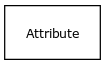

# Class: named thing

a databased entity or concept/class

URI: [http://bioentity.io/vocab/NamedThing](http://bioentity.io/vocab/NamedThing)

## Mappings

 * [UMLSSG:OBJC](http://purl.obolibrary.org/obo/UMLSSG_OBJC)
 * [WD:Q35120](http://purl.obolibrary.org/obo/WD_Q35120)
 * [BFO:0000001](http://purl.obolibrary.org/obo/BFO_0000001)
## Inheritance

## Children

 *  child: [planetary entity](PlanetaryEntity.md) - Any entity or process that exists at the level of the whole planet
 *  child: [information content entity](InformationContentEntity.md) - a piece of information that typically describes some piece of biology or is used as support.
 *  child: [biological entity](BiologicalEntity.md)
 *  child: [device](Device.md) - A thing made or adapted for a particular purpose, especially a piece of mechanical or electronic equipment
 *  child: [clinical entity](ClinicalEntity.md) - Any entity or process that exists in the clinical domain and outside the biological realm. Diseases are placed under biological entities
## Used in

 *  class: [named thing](NamedThing.md) references: [planetary entity](PlanetaryEntity.md)
 *  class: [named thing](NamedThing.md) references: [information content entity](InformationContentEntity.md)
 *  class: [named thing](NamedThing.md) references: [biological entity](BiologicalEntity.md)
 *  class: [named thing](NamedThing.md) references: [device](Device.md)
 *  class: [named thing](NamedThing.md) references: [clinical entity](ClinicalEntity.md)
## Fields

 * _[id](id.md) *subsets: translator_minimal*_
    * _A unique identifier for a thing. Must be either a CURIE shorthand for a URI or a complete URI_
    * range: [identifier type](IdentifierType.md)
    * __Local__
 * _[name](name.md) *subsets: translator_minimal*_
    * _A human-readable name for a thing_
    * range: [label type](LabelType.md)
    * __Local__
 * _[category](category.md) *subsets: translator_minimal*_
    * _Name of the high level ontology class in which this entity is categorized. Corresponds to the label for the biolink entity type class. In a neo4j database this MAY correspond to the neo4j label tag_
    * range: [label type](LabelType.md)
    * __Local__
 * _[related to](related_to.md)_
    * _A grouping for any relationship type that holds between any two things_
    * range: [named thing](NamedThing.md)
    * __Local__
 * _[node property](node_property.md)_
    * _A grouping for any property that holds between a node and a value_
    * range: string
    * __Local__
 * _[iri](iri.md) *subsets: translator_minimal*_
    * _An IRI for the node. This is determined by the id using expansion rules._
    * range: [iri type](IriType.md)
    * __Local__
 * _[full name](full_name.md)_
    * _a long-form human readable name for a thing_
    * range: [label type](LabelType.md)
    * __Local__
 * _[description](description.md) *subsets: translator_minimal*_
    * _a human-readable description of a thing_
    * range: [narrative text](NarrativeText.md)
    * __Local__
 * _[systematic synonym](systematic_synonym.md)_
    * _more commonly used for gene symbols in yeast_
    * range: [label type](LabelType.md)
    * __Local__
