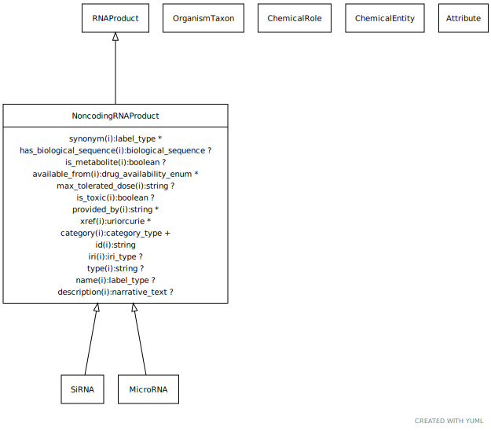

# Type: noncoding RNA product

URI: [biolink:NoncodingRNAProduct](https://w3id.org/biolink/vocab/NoncodingRNAProduct)

## Parents

 *  is_a: [RNAProduct](RNAProduct.md)

## Children

 * [MicroRNA](MicroRNA.md)

## Referenced by class

## Attributes

### Inherited from RNA product:

 * [category](category.md)  1..*
    * Description: Name of the high level ontology class in which this entity is categorized. Corresponds to the label for the biolink entity type class. In a neo4j database this MAY correspond to the neo4j label tag
    * range: [CategoryType](types/CategoryType.md)
    * in subsets: (translator_minimal)
 * [has biological sequence](has_biological_sequence.md)  OPT
    * Description: connects a genomic feature to its sequence
    * range: [BiologicalSequence](types/BiologicalSequence.md)
 * [id](id.md)  REQ
    * Description: A unique identifier for a thing. Must be either a CURIE shorthand for a URI or a complete URI
    * range: [String](types/String.md)
    * in subsets: (translator_minimal)
 * [macromolecular machine➞name](macromolecular_machine_name.md)  REQ
    * Description: genes are typically designated by a short symbol and a full name. We map the symbol to the default display name and use an additional slot for full name
    * range: [SymbolType](types/SymbolType.md)

## Other properties

|  |  |  |
| --- | --- | --- |
| **Mappings:** | | SIO:001235 |

