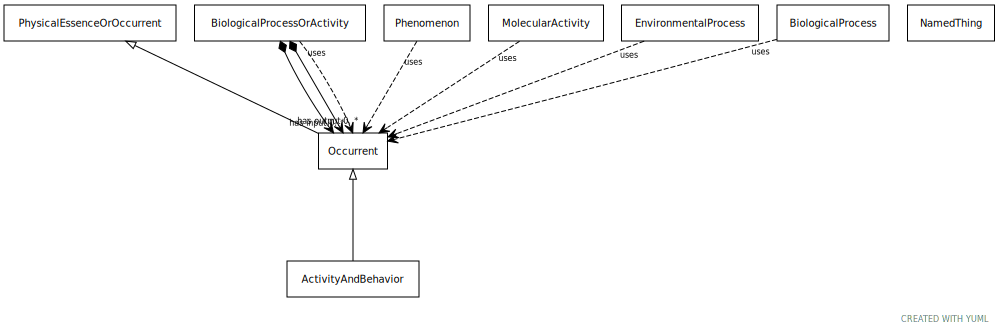

# Type: occurrent

A processual entity

URI: [biolink:Occurrent](https://w3id.org/biolink/vocab/Occurrent)

## Parents

 *  is_a: [NamedThing](NamedThing.md) - a databased entity or concept/class

## Children

 * [ActivityAndBehavior](ActivityAndBehavior.md) - Activity or behavior of any independent integral living, organization or mechanical actor in the world
 * [Phenomenon](Phenomenon.md) - a fact or situation that is observed to exist or happen, especially one whose cause or explanation is in question
 * [Procedure](Procedure.md) - A series of actions conducted in a certain order or manner

## Mixin for

 * [BiologicalProcess](BiologicalProcess.md) (mixin)  - One or more causally connected executions of molecular functions
 * [BiologicalProcessOrActivity](BiologicalProcessOrActivity.md) (mixin)  - Either an individual molecular activity, or a collection of causally connected molecular activities
 * [EnvironmentalProcess](EnvironmentalProcess.md) (mixin) 
 * [MolecularActivity](MolecularActivity.md) (mixin)  - An execution of a molecular function carried out by a gene product or macromolecular complex.

## Referenced by class

 *  **[NamedThing](NamedThing.md)** *[actively involved in](actively_involved_in.md)*  0..*  **[Occurrent](Occurrent.md)**
 *  **[NamedThing](NamedThing.md)** *[capable of](capable_of.md)*  0..*  **[Occurrent](Occurrent.md)**
 *  **[Occurrent](Occurrent.md)** *[negatively regulates, process to process](negatively_regulates_process_to_process.md)*  0..*  **[Occurrent](Occurrent.md)**
 *  **[NamedThing](NamedThing.md)** *[participates in](participates_in.md)*  0..*  **[Occurrent](Occurrent.md)**
 *  **[Occurrent](Occurrent.md)** *[positively regulates, process to process](positively_regulates_process_to_process.md)*  0..*  **[Occurrent](Occurrent.md)**
 *  **[Occurrent](Occurrent.md)** *[preceded by](preceded_by.md)*  0..*  **[Occurrent](Occurrent.md)**
 *  **[Occurrent](Occurrent.md)** *[precedes](precedes.md)*  0..*  **[Occurrent](Occurrent.md)**
 *  **[Occurrent](Occurrent.md)** *[regulates, process to process](regulates_process_to_process.md)*  0..*  **[Occurrent](Occurrent.md)**
 *  **[Occurrent](Occurrent.md)** *[temporally related to](temporally_related_to.md)*  0..*  **[Occurrent](Occurrent.md)**

## Attributes

### Inherited from named thing:

 * [category](category.md)  1..*
    * Description: Name of the high level ontology class in which this entity is categorized. Corresponds to the label for the biolink entity type class. In a neo4j database this MAY correspond to the neo4j label tag
    * range: [CategoryType](types/CategoryType.md)
    * in subsets: (translator_minimal)
 * [id](id.md)  REQ
    * Description: A unique identifier for a thing. Must be either a CURIE shorthand for a URI or a complete URI
    * range: [String](types/String.md)
    * in subsets: (translator_minimal)
 * [name](name.md)  REQ
    * Description: A human-readable name for a thing
    * range: [LabelType](types/LabelType.md)
    * in subsets: (translator_minimal)

## Other properties

|  |  |  |
| --- | --- | --- |
| **Mappings:** | | BFO:0000003 |

