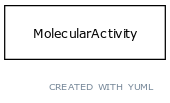

# Class: occurrent

A processual entity

URI: [http://bioentity.io/vocab/Occurrent](http://bioentity.io/vocab/Occurrent)

## Mappings

 * [BFO:0000003](http://purl.obolibrary.org/obo/BFO_0000003)
## Inheritance

## Children

 *  child: [procedure](Procedure.md) - A series of actions conducted in a certain order or manner
 *  child: [phenomenon](Phenomenon.md) - a fact or situation that is observed to exist or happen, especially one whose cause or explanation is in question
 *  child: [activity and behavior](ActivityAndBehavior.md) - Activity or behavior of any independent integral living, organization or mechanical actor in the world
 *  mixin: [molecular activity](MolecularActivity.md) - An execution of a molecular function carried out by a gene product or macromolecular complex.
 *  mixin: [biological process](BiologicalProcess.md) - One or more causally connected executions of molecular functions
 *  mixin: [environmental process](EnvironmentalProcess.md)
## Used in

 *  class: [occurrent](Occurrent.md) references: [procedure](Procedure.md)
 *  class: [occurrent](Occurrent.md) references: [activity and behavior](ActivityAndBehavior.md)
 *  class: [occurrent](Occurrent.md) references: [environmental process](EnvironmentalProcess.md)
 *  class: [occurrent](Occurrent.md) references: [molecular activity](MolecularActivity.md)
 *  class: [occurrent](Occurrent.md) references: [biological process](BiologicalProcess.md)
 *  class: [occurrent](Occurrent.md) references: [phenomenon](Phenomenon.md)
## Fields

 * _[regulates, process to process](regulates_process_to_process.md)_
    * range: [occurrent](Occurrent.md)
    * __Local__
 * _[has participant](has_participant.md) *subsets: translator_minimal*_
    * _holds between a process and a continuant, where the continuant is somehow involved in the process _
    * range: string
    * __Local__
 * _[has input](has_input.md) *subsets: translator_minimal*_
    * _holds between a process and a continuant, where the continuant is an input into the process_
    * range: string
    * __Local__
 * _[precedes](precedes.md) *subsets: translator_minimal*_
    * _holds between two processes, where one completes before the other begins_
    * range: [occurrent](Occurrent.md)
    * __Local__
