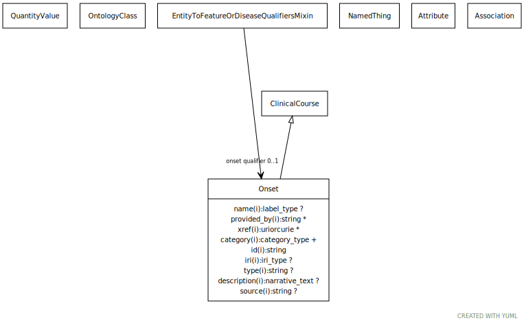

# Type: onset

The age group in which manifestations appear

URI: [biolink:Onset](https://w3id.org/biolink/vocab/Onset)

## Parents

 *  is_a: [ClinicalCourse](ClinicalCourse.md) - The course a disease typically takes from its onset, progression in time, and eventual resolution or death of the affected individual

## Referenced by class

 *  **[Association](Association.md)** *[onset qualifier](onset_qualifier.md)*  OPT  **[Onset](Onset.md)**

## Attributes

### Inherited from clinical course:

 * [has attribute type](has_attribute_type.md)  OPT
    * Description: connects an attribute to a class that describes it
    * range: [OntologyClass](OntologyClass.md)
    * in subsets: (samples)
 * [has qualitative value](has_qualitative_value.md)  OPT
    * Description: connects an attribute to a value
    * range: [NamedThing](NamedThing.md)
    * in subsets: (samples)
 * [has quantitative value](has_quantitative_value.md)  0..*
    * Description: connects an attribute to a value
    * range: [QuantityValue](QuantityValue.md)
    * in subsets: (samples)

## Other properties

|  |  |  |
| --- | --- | --- |
| **Mappings:** | | HP:0003674 |

