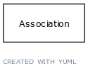

# Class: ontology class

a concept or class in an ontology, vocabulary or thesaurus

URI: [http://bioentity.io/vocab/OntologyClass](http://bioentity.io/vocab/OntologyClass)

## Mappings

## Inheritance

 *  is_a: [NamedThing](NamedThing.md) - a databased entity or concept/class
## Children

 * [GeneOntologyClass](GeneOntologyClass.md) - an ontology class that describes a functional aspect of a gene, gene prodoct or complex
 * [OrganismTaxon](OrganismTaxon.md)
 * [Attribute](Attribute.md) (mixin)  - A property or characteristic of an entity
## Used in

 *  class: **[Association](Association.md)** *[association type](association_type.md)* **[OntologyClass](OntologyClass.md)**
 *  class: **[GeneToExpressionSiteAssociation](GeneToExpressionSiteAssociation.md)** *[gene to expression site association.quantifier qualifier](gene_to_expression_site_association_quantifier_qualifier.md)* **[OntologyClass](OntologyClass.md)**
 *  class: **[NamedThing](NamedThing.md)** *[has molecular consequence](has_molecular_consequence.md)* **[OntologyClass](OntologyClass.md)**
 *  class: **[PairwiseInteractionAssociation](PairwiseInteractionAssociation.md)** *[pairwise interaction association.interacting molecules category](interacting_molecules_category.md)* **[OntologyClass](OntologyClass.md)**
 *  class: **[Association](Association.md)** *[qualifiers](qualifiers.md)* **[OntologyClass](OntologyClass.md)**
 *  class: **[GeneToExpressionSiteAssociation](GeneToExpressionSiteAssociation.md)** *[quantifier qualifier](quantifier_qualifier.md)* **[OntologyClass](OntologyClass.md)**
 *  class: **[OntologyClass](OntologyClass.md)** *[subclass of](subclass_of.md)* **[OntologyClass](OntologyClass.md)**
## Fields

 * [subclass of](subclass_of.md) *subsets*: (translator_minimal)
    * Description: holds between two classes where the domain class is a specialization of the range class
    * range: [OntologyClass](OntologyClass.md)
    * __Local__
 * [category](category.md) *subsets*: (translator_minimal)
    * Description: Name of the high level ontology class in which this entity is categorized. Corresponds to the label for the biolink entity type class. In a neo4j database this MAY correspond to the neo4j label tag
    * range: [IriType](IriType.md)*
    * inherited from: [NamedThing](NamedThing.md)
 * [description](description.md) *subsets*: (translator_minimal)
    * Description: a human-readable description of a thing
    * range: [NarrativeText](NarrativeText.md)
    * inherited from: [NamedThing](NamedThing.md)
 * [full name](full_name.md)
    * Description: a long-form human readable name for a thing
    * range: [LabelType](LabelType.md)
    * inherited from: [NamedThing](NamedThing.md)
 * [id](id.md) *subsets*: (translator_minimal)
    * Description: A unique identifier for a thing. Must be either a CURIE shorthand for a URI or a complete URI
    * range: [IdentifierType](IdentifierType.md)
    * inherited from: [NamedThing](NamedThing.md)
 * [iri](iri.md) *subsets*: (translator_minimal)
    * Description: An IRI for the node. This is determined by the id using expansion rules.
    * range: [IriType](IriType.md)
    * inherited from: [NamedThing](NamedThing.md)
 * [name](name.md) *subsets*: (translator_minimal)
    * Description: A human-readable name for a thing
    * range: [LabelType](LabelType.md)
    * inherited from: [NamedThing](NamedThing.md)
 * [node property](node_property.md)
    * Description: A grouping for any property that holds between a node and a value
    * range: **string**
    * inherited from: [NamedThing](NamedThing.md)
 * [related to](related_to.md)
    * Description: A grouping for any relationship type that holds between any two things
    * range: [NamedThing](NamedThing.md)
    * inherited from: [NamedThing](NamedThing.md)
 * [systematic synonym](systematic_synonym.md)
    * Description: more commonly used for gene symbols in yeast
    * range: [LabelType](LabelType.md)
    * inherited from: [NamedThing](NamedThing.md)
