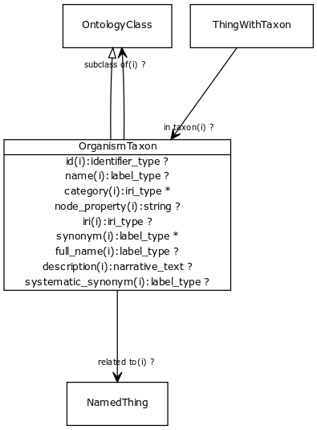

# Class: organism taxon

URI: [http://bioentity.io/vocab/OrganismTaxon](http://bioentity.io/vocab/OrganismTaxon)

## Mappings

 * [WD:Q16521](http://purl.obolibrary.org/obo/WD_Q16521)
## Inheritance

 *  is_a: [ontology class](OntologyClass.md) - a concept or class in an ontology, vocabulary or thesaurus
## Children

## Used in

## Fields

 * _[subclass of](subclass_of.md) *subsets: translator_minimal*_
    * _holds between two classes where the domain class is a specialization of the range class_
    * range: [ontology class](OntologyClass.md)
    * inherited from: [ontology class](OntologyClass.md)
