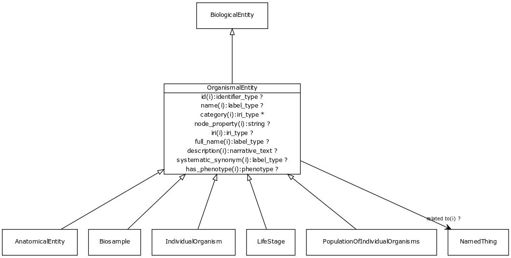

# Class: organismal entity

A named entity that is either a part of an organism, a whole organism, population or clade of organisms, excluding molecular entities

URI: [http://bioentity.io/vocab/OrganismalEntity](http://bioentity.io/vocab/OrganismalEntity)

## Mappings

 * [WD:Q7239](http://purl.obolibrary.org/obo/WD_Q7239)
## Inheritance

 *  is_a: [biological entity](BiologicalEntity.md)
## Children

 *  child: [anatomical entity](AnatomicalEntity.md) - A subcellular location, cell type or gross anatomical part
 *  child: [life stage](LifeStage.md) - A stage of development or growth of an organism, including post-natal adult stages
 *  child: [population of individual organisms](PopulationOfIndividualOrganisms.md)
 *  child: [biosample](Biosample.md)
 *  child: [individual organism](IndividualOrganism.md)
## Used in

 *  class: [organismal entity](OrganismalEntity.md) references: [anatomical entity](AnatomicalEntity.md)
 *  class: [organismal entity](OrganismalEntity.md) references: [life stage](LifeStage.md)
 *  class: [organismal entity](OrganismalEntity.md) references: [population of individual organisms](PopulationOfIndividualOrganisms.md)
 *  class: [organismal entity](OrganismalEntity.md) references: [biosample](Biosample.md)
 *  class: [organismal entity](OrganismalEntity.md) references: [individual organism](IndividualOrganism.md)
## Fields

 * _[related to](related_to.md)_
    * _A grouping for any relationship type that holds between any two things_
    * range: [named thing](NamedThing.md)
    * inherited from: [named thing](NamedThing.md)
