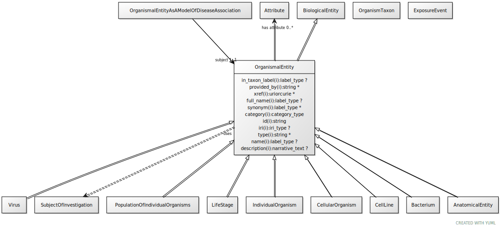

# Type: organismal entity

A named entity that is either a part of an organism, a whole organism, population or clade of organisms, excluding molecular entities

URI: [biolink:OrganismalEntity](https://w3id.org/biolink/vocab/OrganismalEntity)

## Parents

 *  is_a: [BiologicalEntity](BiologicalEntity.md)

## Children

 * [AnatomicalEntity](AnatomicalEntity.md) - A subcellular location, cell type or gross anatomical part
 * [CellLine](CellLine.md)
 * [IndividualOrganism](IndividualOrganism.md)
 * [LifeStage](LifeStage.md) - A stage of development or growth of an organism, including post-natal adult stages
 * [PopulationOfIndividualOrganisms](PopulationOfIndividualOrganisms.md) - A collection of individuals from the same taxonomic class distinguished by one or more characteristics. Characteristics can include, but are not limited to, shared geographic location, genetics, phenotypes [Alliance for Genome Resources]

## Referenced by class

 *  **[ExposureEvent](ExposureEvent.md)** *[has receptor](has_receptor.md)*  OPT  **[OrganismalEntity](OrganismalEntity.md)**
 *  **[OrganismalEntityAsAModelOfDiseaseAssociation](OrganismalEntityAsAModelOfDiseaseAssociation.md)** *[organismal entity as a model of disease association➞subject](organismal_entity_as_a_model_of_disease_association_subject.md)*  REQ  **[OrganismalEntity](OrganismalEntity.md)**

## Attributes

### Inherited from biological entity:

 * [category](category.md)  1..*
    * Description: Name of the high level ontology class in which this entity is categorized. Corresponds to the label for the biolink entity type class. In a neo4j database this MAY correspond to the neo4j label tag
    * range: [CategoryType](types/CategoryType.md)
    * in subsets: (translator_minimal)
 * [id](id.md)  REQ
    * Description: A unique identifier for a thing. Must be either a CURIE shorthand for a URI or a complete URI
    * range: [String](types/String.md)
    * in subsets: (translator_minimal)
 * [name](name.md)  REQ
    * Description: A human-readable name for a thing
    * range: [LabelType](types/LabelType.md)
    * in subsets: (translator_minimal)

## Other properties

|  |  |  |
| --- | --- | --- |
| **Mappings:** | | WIKIDATA:Q7239 |

