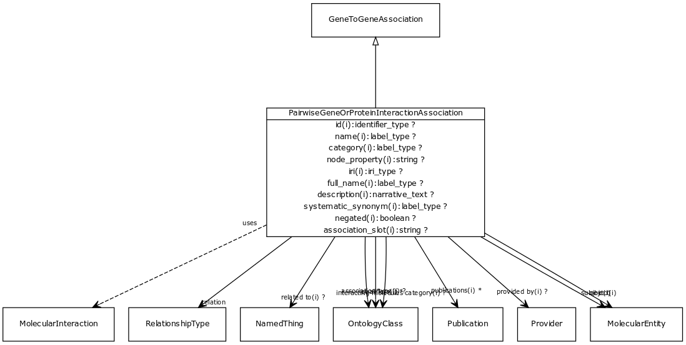

# Class: pairwise gene or protein interaction association

An interaction between two genes or two gene products. May be physical (e.g. protein binding) or genetic (between genes). May be symmetric (e.g. protein interaction) or directed (e.g. phosphorylation)

URI: [http://bioentity.io/vocab/PairwiseGeneOrProteinInteractionAssociation](http://bioentity.io/vocab/PairwiseGeneOrProteinInteractionAssociation)

## Mappings

## Inheritance

 *  is_a: [gene to gene association](GeneToGeneAssociation.md) - abstract parent class for different kinds of gene-gene or gene product to gene product relationships. Includes homology and interaction.
 *  mixin: [molecular interaction](MolecularInteraction.md) - An interaction at the molecular level between two physical entities
## Children

## Used in

## Fields

 * _[relation](relation.md)_
    * _the relationship type by which a subject is connected to an object in an association_
    * range: [relationship type](RelationshipType.md) [required]
    * edge label: [molecularly interacts with](molecularly_interacts_with.md) *subsets: translator_minimal*
    * __Local__
 * _[related to](related_to.md)_
    * _A grouping for any relationship type that holds between any two things_
    * range: [named thing](NamedThing.md)
    * inherited from: [named thing](NamedThing.md)
 * _[association type](association_type.md)_
    * _connects an association to the type of association (e.g. gene to phenotype)_
    * range: [ontology class](OntologyClass.md)
    * inherited from: None
 * _[qualifiers](qualifiers.md)_
    * _connects an association to qualifiers that modify or qualify the meaning of that association_
    * range: [ontology class](OntologyClass.md)*
    * inherited from: None
 * _[publications](publications.md)_
    * _connects an association to publications supporting the association_
    * range: [publication](Publication.md)*
    * inherited from: None
 * _[provided by](provided_by.md)_
    * _connects an association to the agent (person, organization or group) that provided it_
    * range: [provider](Provider.md)
    * inherited from: None
 * _[subject](subject.md)_
    * _connects an association to the subject of the association. For example, in a gene-to-phenotype association, the gene is subject and phenotype is object._
    * range: [gene or gene product](GeneOrGeneProduct.md) [required]
    * inherited from: [gene to gene association](GeneToGeneAssociation.md)
 * _[object](object.md)_
    * _connects an association to the object of the association. For example, in a gene-to-phenotype association, the gene is subject and phenotype is object._
    * range: [gene or gene product](GeneOrGeneProduct.md) [required]
    * inherited from: [gene to gene association](GeneToGeneAssociation.md)
 * _[interacting molecules category](interacting_molecules_category.md)_
    * range: [ontology class](OntologyClass.md)
    * Example: [MI:1048](http://purl.obolibrary.org/obo/MI_1048) smallmolecule-protein
    * inherited from: [molecular interaction](MolecularInteraction.md)
