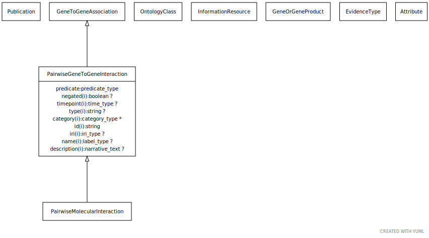

# Type: pairwise gene to gene interaction

An interaction between two genes or two gene products. May be physical (e.g. protein binding) or genetic (between genes). May be symmetric (e.g. protein interaction) or directed (e.g. phosphorylation)

URI: [biolink:PairwiseGeneToGeneInteraction](https://w3id.org/biolink/vocab/PairwiseGeneToGeneInteraction)

## Parents

 *  is_a: [GeneToGeneAssociation](GeneToGeneAssociation.md) - abstract parent class for different kinds of gene-gene or gene product to gene product relationships. Includes homology and interaction.

## Uses Mixins

 *  mixin: [PairwiseInteractionAssociation](PairwiseInteractionAssociation.md) - An interaction at the molecular level between two physical entities

## Referenced by class

## Attributes

### Own

 * [pairwise gene to gene interaction➞relation](pairwise_gene_to_gene_interaction_relation.md)  REQ
    * Description: interaction relationship type
    * range: [Uriorcurie](types/Uriorcurie.md)

### Inherited from gene to gene association:

 * [association type](association_type.md)  OPT
    * Description: connects an association to the type of association (e.g. gene to phenotype)
    * range: [OntologyClass](OntologyClass.md)
 * [association➞id](association_id.md)  REQ
    * Description: A unique identifier for an association
    * range: [String](types/String.md)
    * in subsets: (translator_minimal)
 * [gene to gene association➞object](gene_to_gene_association_object.md)  REQ
    * Description: the object gene in the association. If the relation is symmetric, subject vs object is arbitrary. We allow a gene product to stand as proxy for the gene or vice versa
    * range: [GeneOrGeneProduct](GeneOrGeneProduct.md)
 * [gene to gene association➞subject](gene_to_gene_association_subject.md)  REQ
    * Description: the subject gene in the association. If the relation is symmetric, subject vs object is arbitrary. We allow a gene product to stand as proxy for the gene or vice versa
    * range: [GeneOrGeneProduct](GeneOrGeneProduct.md)
 * [negated](negated.md)  OPT
    * Description: if set to true, then the association is negated i.e. is not true
    * range: [Boolean](types/Boolean.md)
 * [provided by](provided_by.md)  0..*
    * Description: connects an association to the agent (person, organization or group) that provided it
    * range: [Provider](Provider.md)
 * [publications](publications.md)  0..*
    * Description: connects an association to publications supporting the association
    * range: [Publication](Publication.md)
 * [qualifiers](qualifiers.md)  0..*
    * Description: connects an association to qualifiers that modify or qualify the meaning of that association
    * range: [OntologyClass](OntologyClass.md)

### Mixed in from pairwise interaction association:

 * [pairwise interaction association➞interacting molecules category](pairwise_interaction_association_interacting_molecules_category.md)  OPT
    * range: [OntologyClass](OntologyClass.md)
    * Example:    
