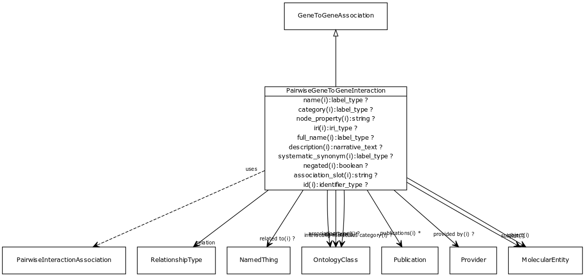

# Class: pairwise gene to gene interaction

An interaction between two genes or two gene products. May be physical (e.g. protein binding) or genetic (between genes). May be symmetric (e.g. protein interaction) or directed (e.g. phosphorylation)

URI: [http://w3id.org/biolink/vocab/PairwiseGeneToGeneInteraction](http://w3id.org/biolink/vocab/PairwiseGeneToGeneInteraction)

## Mappings

## Inheritance

 *  is_a: [GeneToGeneAssociation](GeneToGeneAssociation.md) - abstract parent class for different kinds of gene-gene or gene product to gene product relationships. Includes homology and interaction.
 *  mixin: [PairwiseInteractionAssociation](PairwiseInteractionAssociation.md) - An interaction at the molecular level between two physical entities
## Children

## Used in

## Fields

 * [pairwise gene to gene interaction.relation](pairwise_gene_to_gene_interaction_relation.md)
    * Description: interaction relationship type
    * range: [IriType](IriType.md) [required]
    * edge label: [molecularly interacts with](molecularly_interacts_with.md) *subsets*: (translator_minimal)
    * __Local__
 * [association slot](association_slot.md)
    * Description: any slot that relates an association to another entity
    * range: **string**
    * inherited from: [Association](Association.md)
 * [association type](association_type.md)
    * Description: connects an association to the type of association (e.g. gene to phenotype)
    * range: [OntologyClass](OntologyClass.md)
    * inherited from: [Association](Association.md)
 * [association.id](association_id.md) *subsets*: (translator_minimal)
    * Description: A unique identifier for an association
    * range: [IdentifierType](IdentifierType.md)
    * inherited from: [Association](Association.md)
 * [gene to gene association.object](gene_to_gene_association_object.md)
    * Description: the object gene in the association. If the relation is symmetric, subject vs object is arbitrary. We allow a gene product to stand as proxy for the gene or vice versa
    * range: [GeneOrGeneProduct](GeneOrGeneProduct.md) [required]
    * inherited from: [GeneToGeneAssociation](GeneToGeneAssociation.md)
 * [gene to gene association.subject](gene_to_gene_association_subject.md)
    * Description: the subject gene in the association. If the relation is symmetric, subject vs object is arbitrary. We allow a gene product to stand as proxy for the gene or vice versa
    * range: [GeneOrGeneProduct](GeneOrGeneProduct.md) [required]
    * inherited from: [GeneToGeneAssociation](GeneToGeneAssociation.md)
 * [pairwise interaction association.interacting molecules category](interacting_molecules_category.md)
    * range: [OntologyClass](OntologyClass.md)
    * inherited from: [PairwiseInteractionAssociation](PairwiseInteractionAssociation.md)
 * [negated](negated.md)
    * Description: if set to true, then the association is negated i.e. is not true
    * range: **boolean**
    * inherited from: [Association](Association.md)
 * [provided by](provided_by.md)
    * Description: connects an association to the agent (person, organization or group) that provided it
    * range: [Provider](Provider.md)
    * inherited from: [Association](Association.md)
 * [publications](publications.md)
    * Description: connects an association to publications supporting the association
    * range: [Publication](Publication.md)*
    * inherited from: [Association](Association.md)
 * [qualifiers](qualifiers.md)
    * Description: connects an association to qualifiers that modify or qualify the meaning of that association
    * range: [OntologyClass](OntologyClass.md)*
    * inherited from: [Association](Association.md)
