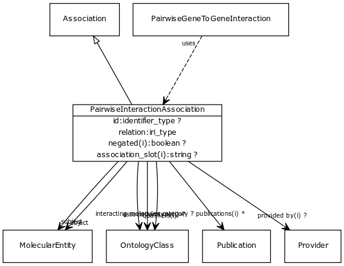

# Class: pairwise interaction association

An interaction at the molecular level between two physical entities

URI: [http://w3id.org/biolink/vocab/PairwiseInteractionAssociation](http://w3id.org/biolink/vocab/PairwiseInteractionAssociation)

## Mappings

## Inheritance

 *  is_a: [Association](Association.md) - A typed association between two entities, supported by evidence
## Children

 * [PairwiseGeneToGeneInteraction](PairwiseGeneToGeneInteraction.md) (mixin)  - An interaction between two genes or two gene products. May be physical (e.g. protein binding) or genetic (between genes). May be symmetric (e.g. protein interaction) or directed (e.g. phosphorylation)
## Used in

## Fields

 * [pairwise interaction association.interacting molecules category](interacting_molecules_category.md)
    * range: [OntologyClass](OntologyClass.md)
    * __Local__
 * [pairwise interaction association.id](pairwise_interaction_association_id.md) *subsets*: (translator_minimal)
    * Description: identifier for the interaction. This may come from an interaction database such as IMEX.
    * range: [IdentifierType](IdentifierType.md)
    * __Local__
 * [pairwise interaction association.object](pairwise_interaction_association_object.md)
    * Description: connects an association to the object of the association. For example, in a gene-to-phenotype association, the gene is subject and phenotype is object.
    * range: [MolecularEntity](MolecularEntity.md) [required]
    * __Local__
 * [pairwise interaction association.relation](pairwise_interaction_association_relation.md)
    * Description: interaction relationship type
    * range: [RelationshipType](RelationshipType.md) [required]
    * edge label: [molecularly interacts with](molecularly_interacts_with.md) *subsets*: (translator_minimal)
    * __Local__
 * [pairwise interaction association.subject](pairwise_interaction_association_subject.md)
    * Description: connects an association to the subject of the association. For example, in a gene-to-phenotype association, the gene is subject and phenotype is object.
    * range: [MolecularEntity](MolecularEntity.md) [required]
    * __Local__
 * [association slot](association_slot.md)
    * Description: any slot that relates an association to another entity
    * range: **string**
    * inherited from: [Association](Association.md)
 * [association type](association_type.md)
    * Description: connects an association to the type of association (e.g. gene to phenotype)
    * range: [OntologyClass](OntologyClass.md)
    * inherited from: [Association](Association.md)
 * [negated](negated.md)
    * Description: if set to true, then the association is negated i.e. is not true
    * range: **boolean**
    * inherited from: [Association](Association.md)
 * [provided by](provided_by.md)
    * Description: connects an association to the agent (person, organization or group) that provided it
    * range: [Provider](Provider.md)
    * inherited from: [Association](Association.md)
 * [publications](publications.md)
    * Description: connects an association to publications supporting the association
    * range: [Publication](Publication.md)*
    * inherited from: [Association](Association.md)
 * [qualifiers](qualifiers.md)
    * Description: connects an association to qualifiers that modify or qualify the meaning of that association
    * range: [OntologyClass](OntologyClass.md)*
    * inherited from: [Association](Association.md)
