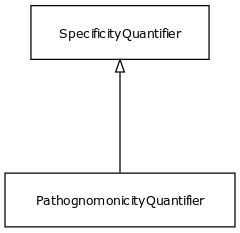

# Class: pathognomonicity quantifier

A relationship quantifier between a variant or symptom and a disease, which is high when the presence of the feature implies the existence of the disease

URI: [biolink:PathognomonicityQuantifier](https://w3id.org/biolink/vocab/PathognomonicityQuantifier)

## Parents

 *  is_a: [SpecificityQuantifier](SpecificityQuantifier.md)

## Attributes

