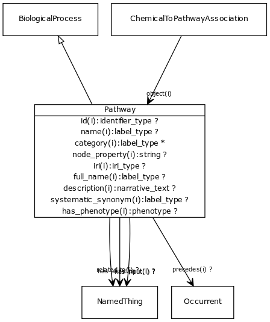

# Type: pathway

URI: [biolink:Pathway](https://w3id.org/biolink/vocab/Pathway)

## Parents

 *  is_a: [BiologicalProcess](BiologicalProcess.md) - One or more causally connected executions of molecular functions

## Referenced by class

 *  **[ChemicalToPathwayAssociation](ChemicalToPathwayAssociation.md)** *[chemical to pathway association➞object](chemical_to_pathway_association_object.md)*  REQ  **[Pathway](Pathway.md)**

## Attributes

### Inherited from named thing:

 * [id](id.md)  REQ
    * Description: A unique identifier for a thing. Must be either a CURIE shorthand for a URI or a complete URI
    * range: [IdentifierType](types/IdentifierType.md)
    * inherited from: [NamedThing](NamedThing.md)
    * in subsets: (translator_minimal)
 * [name](name.md)  REQ
    * Description: A human-readable name for a thing
    * range: [LabelType](types/LabelType.md)
    * inherited from: [NamedThing](NamedThing.md)
    * in subsets: (translator_minimal)
 * [category](category.md)  1..*
    * Description: Name of the high level ontology class in which this entity is categorized. Corresponds to the label for the biolink entity type class. In a neo4j database this MAY correspond to the neo4j label tag
    * range: [IriType](types/IriType.md)
    * inherited from: [NamedThing](NamedThing.md)
    * in subsets: (translator_minimal)

## Other properties

|  |  |  |
| --- | --- | --- |
| **Mappings:** | | GO:0007165 |
|  | | SIO:010526 |
|  | | PW:0000001 |
|  | | WD:Q4915012 |

