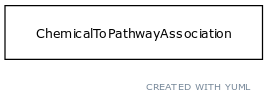

# Class: pathway

URI: [http://bioentity.io/vocab/Pathway](http://bioentity.io/vocab/Pathway)

## Mappings

 * [GO:0007165](http://purl.obolibrary.org/obo/GO_0007165)
 * [SIO:010526](http://semanticscience.org/resource/SIO_010526)
 * [PW:0000001](http://purl.obolibrary.org/obo/PW_0000001)
 * [WD:Q4915012](http://purl.obolibrary.org/obo/WD_Q4915012)
## Inheritance

 *  is_a: [biological process](BiologicalProcess.md) - One or more causally connected executions of molecular functions
## Children

## Used in

## Fields

 * _[related to](related_to.md)_
    * _A grouping for any relationship type that holds between any two things_
    * range: [named thing](NamedThing.md)
    * inherited from: [named thing](NamedThing.md)
 * _[regulates, process to process](regulates_process_to_process.md)_
    * range: [occurrent](Occurrent.md)
    * inherited from: [occurrent](Occurrent.md)
 * _[precedes](precedes.md) *subsets: translator_minimal*_
    * _holds between two processes, where one completes before the other begins_
    * range: [occurrent](Occurrent.md)
    * inherited from: [occurrent](Occurrent.md)
