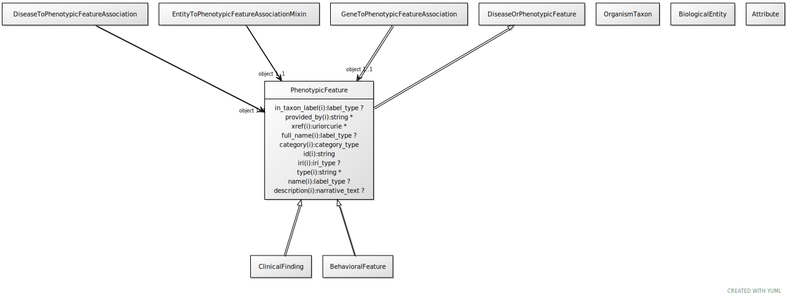

# Type: phenotypic feature

URI: [biolink:PhenotypicFeature](https://w3id.org/biolink/vocab/PhenotypicFeature)

## Parents

 *  is_a: [DiseaseOrPhenotypicFeature](DiseaseOrPhenotypicFeature.md) - Either one of a disease or an individual phenotypic feature. Some knowledge resources such as Monarch treat these as distinct, others such as MESH conflate.

## Referenced by class

 *  **[EntityToPhenotypicFeatureAssociation](EntityToPhenotypicFeatureAssociation.md)** *[entity to phenotypic feature association➞object](entity_to_phenotypic_feature_association_object.md)*  REQ  **[PhenotypicFeature](PhenotypicFeature.md)**
 *  **[BiologicalEntity](BiologicalEntity.md)** *[has phenotype](has_phenotype.md)*  0..*  **[PhenotypicFeature](PhenotypicFeature.md)**

## Attributes

### Inherited from disease or phenotypic feature:

 * [category](category.md)  1..*
    * Description: Name of the high level ontology class in which this entity is categorized. Corresponds to the label for the biolink entity type class. In a neo4j database this MAY correspond to the neo4j label tag
    * range: [CategoryType](types/CategoryType.md)
    * in subsets: (translator_minimal)
 * [id](id.md)  REQ
    * Description: A unique identifier for a thing. Must be either a CURIE shorthand for a URI or a complete URI
    * range: [String](types/String.md)
    * in subsets: (translator_minimal)
 * [name](name.md)  REQ
    * Description: A human-readable name for a thing
    * range: [LabelType](types/LabelType.md)
    * in subsets: (translator_minimal)

## Other properties

|  |  |  |
| --- | --- | --- |
| **Aliases:** | | sign |
|  | | symptom |
|  | | phenotype |
|  | | trait |
|  | | endophenotype |
| **Mappings:** | | UPHENO:0001001 |
|  | | SIO:010056 |
|  | | WIKIDATA:Q169872 |

