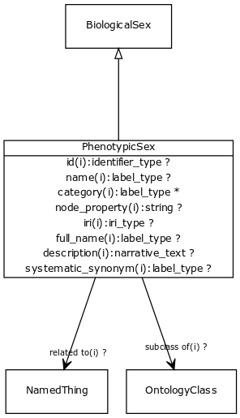

# Class: phenotypic sex

An attribute corresponding to the phenotypic sex of the individual, based upon the reproductive organs present.

URI: [http://bioentity.io/vocab/PhenotypicSex](http://bioentity.io/vocab/PhenotypicSex)

## Mappings

 * [PATO:0001894](http://purl.obolibrary.org/obo/PATO_0001894)
## Inheritance

 *  is_a: [BiologicalSex](BiologicalSex.md)
## Children

## Fields

 * _[subclass of](subclass_of.md) *subsets*: (translator_minimal)_
    * _holds between two classes where the domain class is a specialization of the range class_
    * range: [OntologyClass](OntologyClass.md)
    * inherited from: [OntologyClass](OntologyClass.md)
