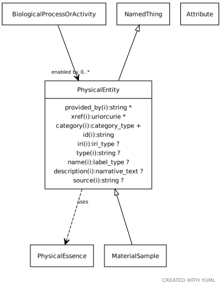

# Type: physical entity

An entity that has physical properties such as mass, volume, or charge

URI: [biolink:PhysicalEntity](https://w3id.org/biolink/vocab/PhysicalEntity)

## Parents

 *  is_a: [NamedThing](NamedThing.md) - a databased entity or concept/class

## Mixin for

 * [AnatomicalEntity](AnatomicalEntity.md) (mixin)  - A subcellular location, cell type or gross anatomical part
 * [MaterialSample](MaterialSample.md) (mixin)  - A sample is a limited quantity of something (e.g. an individual or set of individuals from a population, or a portion of a substance) to be used for testing, analysis, inspection, investigation, demonstration, or trial use. [SIO]
 * [MolecularEntity](MolecularEntity.md) (mixin)  - A gene, gene product, small molecule or macromolecule (including protein complex)

## Referenced by class

## Attributes

### Inherited from named thing:

 * [category](category.md)  1..*
    * Description: Name of the high level ontology class in which this entity is categorized. Corresponds to the label for the biolink entity type class. In a neo4j database this MAY correspond to the neo4j label tag
    * range: [CategoryType](types/CategoryType.md)
    * in subsets: (translator_minimal)
 * [id](id.md)  REQ
    * Description: A unique identifier for a thing. Must be either a CURIE shorthand for a URI or a complete URI
    * range: [String](types/String.md)
    * in subsets: (translator_minimal)
 * [name](name.md)  REQ
    * Description: A human-readable name for a thing
    * range: [LabelType](types/LabelType.md)
    * in subsets: (translator_minimal)
