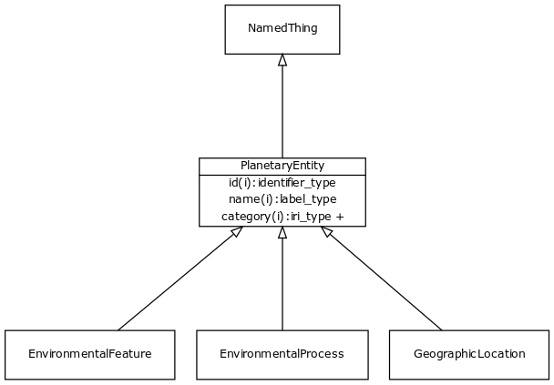

# Class: planetary entity

Any entity or process that exists at the level of the whole planet

URI: [http://bioentity.io/vocab/PlanetaryEntity](http://bioentity.io/vocab/PlanetaryEntity)

## Mappings

## Inheritance

 *  is_a: [named thing](NamedThing.md) - a databased entity or concept/class
## Children

 *  child: [environmental feature](EnvironmentalFeature.md)
 *  child: [environmental process](EnvironmentalProcess.md)
 *  child: [geographic location](GeographicLocation.md) - a location that can be described in lat/long coordinates
 *  child: [geographic location at time](GeographicLocationAtTime.md) - a location that can be described in lat/long coordinates, for a particular time
## Used in

 *  class: [planetary entity](PlanetaryEntity.md) references: [environmental feature](EnvironmentalFeature.md)
 *  class: [planetary entity](PlanetaryEntity.md) references: [environmental process](EnvironmentalProcess.md)
 *  class: [planetary entity](PlanetaryEntity.md) references: [geographic location](GeographicLocation.md)
 *  class: [planetary entity](PlanetaryEntity.md) references: [geographic location at time](GeographicLocationAtTime.md)
## Fields

 * _[related to](related_to.md)_
    * _A grouping for any relationship type that holds between any two things_
    * range: [named thing](NamedThing.md)
    * inherited from: [named thing](NamedThing.md)
