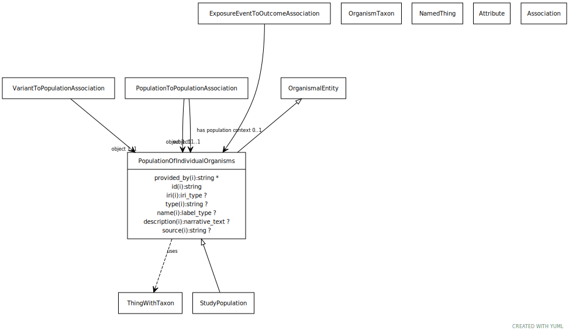

# Type: population of individual organisms

A collection of individuals from the same taxonomic class distinguished by one or more characteristics. Characteristics can include, but are not limited to, shared geographic location, genetics, phenotypes [Alliance for Genome Resources]

URI: [biolink:PopulationOfIndividualOrganisms](https://w3id.org/biolink/vocab/PopulationOfIndividualOrganisms)

## Parents

 *  is_a: [OrganismalEntity](OrganismalEntity.md) - A named entity that is either a part of an organism, a whole organism, population or clade of organisms, excluding molecular entities

## Uses Mixins

 *  mixin: [ThingWithTaxon](ThingWithTaxon.md) - A mixin that can be used on any entity with a taxon

## Referenced by class

 *  **[PopulationToPopulationAssociation](PopulationToPopulationAssociation.md)** *[population to population association➞object](population_to_population_association_object.md)*  REQ  **[PopulationOfIndividualOrganisms](PopulationOfIndividualOrganisms.md)**
 *  **[PopulationToPopulationAssociation](PopulationToPopulationAssociation.md)** *[population to population association➞subject](population_to_population_association_subject.md)*  REQ  **[PopulationOfIndividualOrganisms](PopulationOfIndividualOrganisms.md)**
 *  **[VariantToPopulationAssociation](VariantToPopulationAssociation.md)** *[variant to population association➞object](variant_to_population_association_object.md)*  REQ  **[PopulationOfIndividualOrganisms](PopulationOfIndividualOrganisms.md)**

## Attributes

### Inherited from organismal entity:

 * [category](category.md)  1..*
    * Description: Name of the high level ontology class in which this entity is categorized. Corresponds to the label for the biolink entity type class. In a neo4j database this MAY correspond to the neo4j label tag
    * range: [CategoryType](types/CategoryType.md)
    * in subsets: (translator_minimal)
 * [id](id.md)  REQ
    * Description: A unique identifier for a thing. Must be either a CURIE shorthand for a URI or a complete URI
    * range: [String](types/String.md)
    * in subsets: (translator_minimal)
 * [name](name.md)  REQ
    * Description: A human-readable name for a thing
    * range: [LabelType](types/LabelType.md)
    * in subsets: (translator_minimal)

### Mixed in from thing with taxon:

 * [in taxon](in_taxon.md)  0..*
    * Description: connects a thing to a class representing a taxon
    * range: [OrganismTaxon](OrganismTaxon.md)
    * in subsets: (translator_minimal)

## Other properties

|  |  |  |
| --- | --- | --- |
| **Local names:** | | population (ga4gh) |
|  | | population (agr) |
| **Mappings:** | | SIO:001061 |
|  | | UMLSSC:T098 |
|  | | UMLSST:popg |
|  | | OBI:0000181 |

