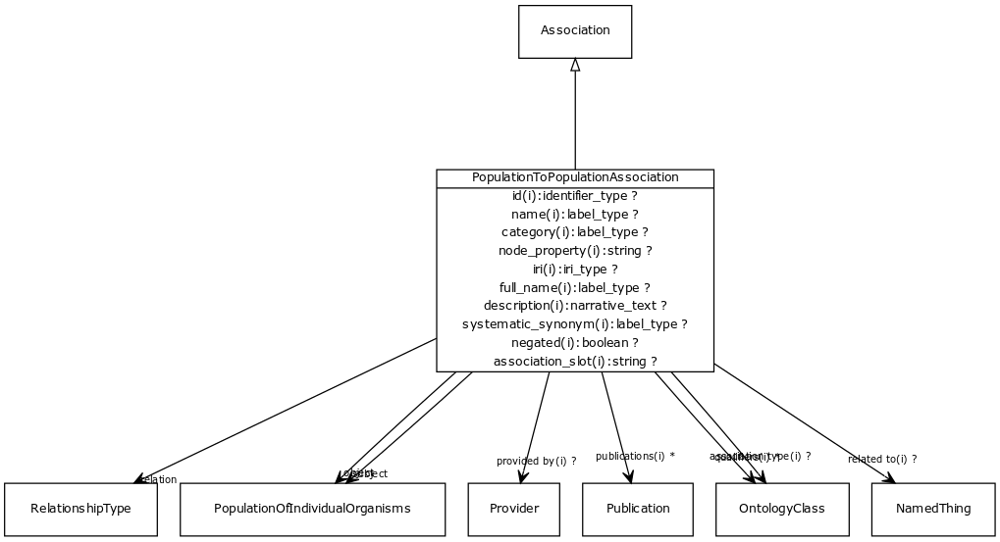

# Class: population to population association

An association between a two populations

URI: [http://w3id.org/biolink/vocab/PopulationToPopulationAssociation](http://w3id.org/biolink/vocab/PopulationToPopulationAssociation)

## Mappings

## Inheritance

 *  is_a: [Association](Association.md) - A typed association between two entities, supported by evidence
## Children

## Used in

## Fields

 * [population to population association.object](population_to_population_association_object.md)
    * Description: the population that form the object of the association
    * range: [PopulationOfIndividualOrganisms](PopulationOfIndividualOrganisms.md) [required]
    * __Local__
 * [population to population association.relation](population_to_population_association_relation.md)
    * Description: A relationship type that holds between the subject and object populations. Standard mereological relations can be used. E.g. subject part-of object, subject overlaps object. Derivation relationships can also be used
    * range: [RelationshipType](RelationshipType.md) [required]
    * __Local__
 * [population to population association.subject](population_to_population_association_subject.md)
    * Description: the population that form the subject of the association
    * range: [PopulationOfIndividualOrganisms](PopulationOfIndividualOrganisms.md) [required]
    * __Local__
 * [association slot](association_slot.md)
    * Description: any slot that relates an association to another entity
    * range: **string**
    * inherited from: [Association](Association.md)
 * [association type](association_type.md)
    * Description: connects an association to the type of association (e.g. gene to phenotype)
    * range: [OntologyClass](OntologyClass.md)
    * inherited from: [Association](Association.md)
 * [association.id](association_id.md) *subsets*: (translator_minimal)
    * Description: A unique identifier for an association
    * range: [IdentifierType](IdentifierType.md)
    * inherited from: [Association](Association.md)
 * [negated](negated.md)
    * Description: if set to true, then the association is negated i.e. is not true
    * range: **boolean**
    * inherited from: [Association](Association.md)
 * [provided by](provided_by.md)
    * Description: connects an association to the agent (person, organization or group) that provided it
    * range: [Provider](Provider.md)
    * inherited from: [Association](Association.md)
 * [publications](publications.md)
    * Description: connects an association to publications supporting the association
    * range: [Publication](Publication.md)*
    * inherited from: [Association](Association.md)
 * [qualifiers](qualifiers.md)
    * Description: connects an association to qualifiers that modify or qualify the meaning of that association
    * range: [OntologyClass](OntologyClass.md)*
    * inherited from: [Association](Association.md)
