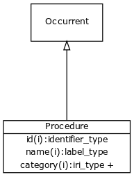

# Class: procedure

A series of actions conducted in a certain order or manner

URI: [http://bioentity.io/vocab/Procedure](http://bioentity.io/vocab/Procedure)

## Mappings

 * [UMLSSG:PROC](http://purl.obolibrary.org/obo/UMLSSG_PROC)
## Inheritance

 *  is_a: [occurrent](Occurrent.md) - A processual entity
## Children

## Fields

 * _[regulates, process to process](regulates_process_to_process.md)_
    * range: [occurrent](Occurrent.md)
    * inherited from: [occurrent](Occurrent.md)
 * _[precedes](precedes.md) *subsets: translator_minimal*_
    * _holds between two processes, where one completes before the other begins_
    * range: [occurrent](Occurrent.md)
    * inherited from: [occurrent](Occurrent.md)
