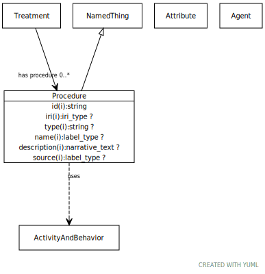

# Type: procedure

A series of actions conducted in a certain order or manner

URI: [biolink:Procedure](https://w3id.org/biolink/vocab/Procedure)

## Parents

 *  is_a: [Occurrent](Occurrent.md) - A processual entity

## Attributes

### Inherited from occurrent:

 * [category](category.md)  1..*
    * Description: Name of the high level ontology class in which this entity is categorized. Corresponds to the label for the biolink entity type class. In a neo4j database this MAY correspond to the neo4j label tag
    * range: [CategoryType](types/CategoryType.md)
    * in subsets: (translator_minimal)
 * [id](id.md)  REQ
    * Description: A unique identifier for a thing. Must be either a CURIE shorthand for a URI or a complete URI
    * range: [String](types/String.md)
    * in subsets: (translator_minimal)
 * [name](name.md)  REQ
    * Description: A human-readable name for a thing
    * range: [LabelType](types/LabelType.md)
    * in subsets: (translator_minimal)

## Other properties

|  |  |  |
| --- | --- | --- |
| **Mappings:** | | UMLSSG:PROC |
|  | | UMLSSC:T058 |
|  | | UMLSST:hlca |
|  | | UMLSSC:T059 |
|  | | UMLSST:lbpr |
|  | | UMLSSC:T060 |
|  | | UMLSST:diap |
|  | | UMLSSC:T061 |
|  | | UMLSST:topp |
|  | | UMLSSC:T062 |
|  | | UMLSST:resa |
|  | | UMLSSC:T063 |
|  | | UMLSST:mbrt |
|  | | UMLSSC:T065 |
|  | | UMLSST:edac |

