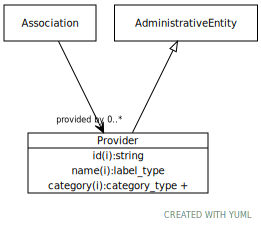

# Type: provider

person, group, organization or project that provides a piece of information

URI: [biolink:Provider](https://w3id.org/biolink/vocab/Provider)

## Parents

 *  is_a: [AdministrativeEntity](AdministrativeEntity.md)

## Referenced by class

 *  **[Association](Association.md)** *[provided by](provided_by.md)*  0..*  **[Provider](Provider.md)**

## Attributes

### Inherited from administrative entity:

 * [category](category.md)  1..*
    * Description: Name of the high level ontology class in which this entity is categorized. Corresponds to the label for the biolink entity type class. In a neo4j database this MAY correspond to the neo4j label tag
    * range: [CategoryType](types/CategoryType.md)
    * in subsets: (translator_minimal)
 * [id](id.md)  REQ
    * Description: A unique identifier for a thing. Must be either a CURIE shorthand for a URI or a complete URI
    * range: [String](types/String.md)
    * in subsets: (translator_minimal)
 * [name](name.md)  REQ
    * Description: A human-readable name for a thing
    * range: [LabelType](types/LabelType.md)
    * in subsets: (translator_minimal)

## Other properties

|  |  |  |
| --- | --- | --- |
| **Aliases:** | | agent |
|  | | group |
| **Mappings:** | | UMLSSG:ORGA |
|  | | UMLSSC:T092 |
|  | | UMLSST:orgt |
|  | | UMLSSC:T093 |
|  | | UMLSST:hcro |
|  | | UMLSSC:T094 |
|  | | UMLSST:pros |
|  | | UMLSSC:T095 |
|  | | UMLSST:shro |
|  | | prov:Agent |

