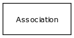

# Class: provider

person, group, organization or project that provides a piece of information

URI: [http://bioentity.io/vocab/Provider](http://bioentity.io/vocab/Provider)

## Mappings

 * [UMLSSG:ORGA](http://purl.obolibrary.org/obo/UMLSSG_ORGA)
## Inheritance

 *  is_a: [administrative entity](AdministrativeEntity.md)
## Children

## Used in

## Fields

