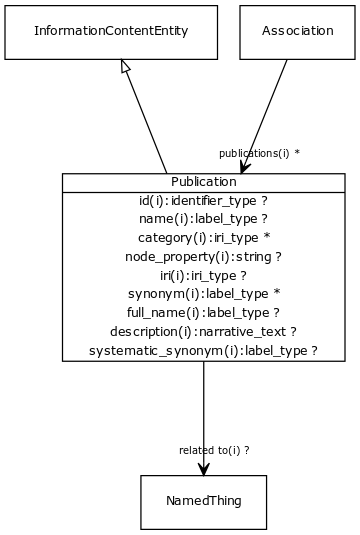

# Class: publication

Any published piece of information. Can refer to a whole publication, or to a part of it (e.g. a figure, figure legend, or section highlighted by NLP). The scope is intended to be general and include information published on the web as well as journals.

URI: [http://bioentity.io/vocab/Publication](http://bioentity.io/vocab/Publication)

## Mappings

 * [IAO:0000311](http://purl.obolibrary.org/obo/IAO_0000311)
## Inheritance

 *  is_a: [information content entity](InformationContentEntity.md) - a piece of information that typically describes some piece of biology or is used as support.
## Children

## Used in

## Fields

 * _[related to](related_to.md)_
    * _A grouping for any relationship type that holds between any two things_
    * range: [named thing](NamedThing.md)
    * inherited from: [named thing](NamedThing.md)
