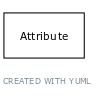

# Class: quantity value

A value of an attribute that is quantitative and measurable, expressed as a combination of a unit and a numeric value

URI: [biolink:QuantityValue](https://w3id.org/biolink/vocab/QuantityValue)

## Parents

 *  is_a: [AbstractEntity](AbstractEntity.md) - Any thing that is not a process or a physical mass-bearing entity

## Referenced by class

 *  **[Attribute](Attribute.md)** *[has quantitative value](has_quantitative_value.md)*  0..*  **[QuantityValue](QuantityValue.md)**

## Attributes

### Own

 * [has numeric value](has_numeric_value.md)  OPT
    * Description: connects a quantity value to a number
    * range: [Double](Double.md)
    * in subsets: (samples)
 * [has unit](has_unit.md)  OPT
    * Description: connects a quantity value to a unit
    * range: [Unit](Unit.md)
    * in subsets: (samples)

### Domain for slot:

 * [has numeric value](has_numeric_value.md)  OPT
    * Description: connects a quantity value to a number
    * range: [Double](Double.md)
    * in subsets: (samples)
 * [has unit](has_unit.md)  OPT
    * Description: connects a quantity value to a unit
    * range: [Unit](Unit.md)
    * in subsets: (samples)
