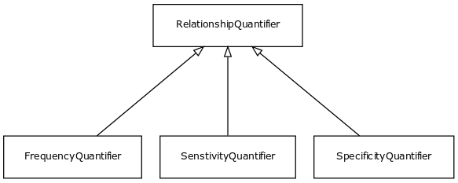

# Class: relationship quantifier

URI: [http://w3id.org/biolink/vocab/RelationshipQuantifier](http://w3id.org/biolink/vocab/RelationshipQuantifier)

## Mappings

## Inheritance

## Children

 * [FrequencyQuantifier](FrequencyQuantifier.md)
 * [SenstivityQuantifier](SenstivityQuantifier.md)
 * [SpecificityQuantifier](SpecificityQuantifier.md)
## Used in

## Fields

