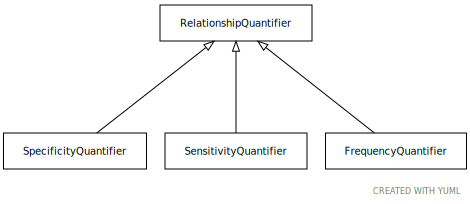

# Type: relationship quantifier

URI: [biolink:RelationshipQuantifier](https://w3id.org/biolink/vocab/RelationshipQuantifier)

## Children

 * [FrequencyQuantifier](FrequencyQuantifier.md)
 * [SensitivityQuantifier](SensitivityQuantifier.md)
 * [SpecificityQuantifier](SpecificityQuantifier.md)

## Referenced by class

## Attributes

