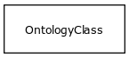

# Class: relationship type

An OWL property used as an edge label

URI: [http://w3id.org/biolink/vocab/RelationshipType](http://w3id.org/biolink/vocab/RelationshipType)

## Mappings

## Inheritance

 *  is_a: [OntologyClass](OntologyClass.md) - a concept or class in an ontology, vocabulary or thesaurus
## Children

## Used in

 *  class: **[AnatomicalEntityToAnatomicalEntityOntogenicAssociation](AnatomicalEntityToAnatomicalEntityOntogenicAssociation.md)** *[anatomical entity to anatomical entity ontogenic association.relation](anatomical_entity_to_anatomical_entity_ontogenic_association_relation.md)* **[RelationshipType](RelationshipType.md)**
 *  class: **[AnatomicalEntityToAnatomicalEntityPartOfAssociation](AnatomicalEntityToAnatomicalEntityPartOfAssociation.md)** *[anatomical entity to anatomical entity part of association.relation](anatomical_entity_to_anatomical_entity_part_of_association_relation.md)* **[RelationshipType](RelationshipType.md)**
 *  class: **[GeneRegulatoryRelationship](GeneRegulatoryRelationship.md)** *[gene regulatory relationship.relation](gene_regulatory_relationship_relation.md)* **[RelationshipType](RelationshipType.md)**
 *  class: **[GeneToExpressionSiteAssociation](GeneToExpressionSiteAssociation.md)** *[gene to expression site association.relation](gene_to_expression_site_association_relation.md)* **[RelationshipType](RelationshipType.md)**
 *  class: **[GeneToGeneHomologyAssociation](GeneToGeneHomologyAssociation.md)** *[gene to gene homology association.relation](gene_to_gene_homology_association_relation.md)* **[RelationshipType](RelationshipType.md)**
 *  class: **[GeneToGeneProductRelationship](GeneToGeneProductRelationship.md)** *[gene to gene product relationship.relation](gene_to_gene_product_relationship_relation.md)* **[RelationshipType](RelationshipType.md)**
 *  class: **[GenotypeToGeneAssociation](GenotypeToGeneAssociation.md)** *[genotype to gene association.relation](genotype_to_gene_association_relation.md)* **[RelationshipType](RelationshipType.md)**
 *  class: **[GenotypeToGenotypePartAssociation](GenotypeToGenotypePartAssociation.md)** *[genotype to genotype part association.relation](genotype_to_genotype_part_association_relation.md)* **[RelationshipType](RelationshipType.md)**
 *  class: **[GenotypeToPhenotypicFeatureAssociation](GenotypeToPhenotypicFeatureAssociation.md)** *[genotype to phenotypic feature association.relation](genotype_to_phenotypic_feature_association_relation.md)* **[RelationshipType](RelationshipType.md)**
 *  class: **[GenotypeToVariantAssociation](GenotypeToVariantAssociation.md)** *[genotype to variant association.relation](genotype_to_variant_association_relation.md)* **[RelationshipType](RelationshipType.md)**
 *  class: **[ModelToDiseaseMixin](ModelToDiseaseMixin.md)** *[model to disease mixin.relation](model_to_disease_mixin_relation.md)* **[RelationshipType](RelationshipType.md)**
 *  class: **[PairwiseGeneToGeneInteraction](PairwiseGeneToGeneInteraction.md)** *[pairwise gene to gene interaction.relation](pairwise_gene_to_gene_interaction_relation.md)* **[RelationshipType](RelationshipType.md)**
 *  class: **[PairwiseInteractionAssociation](PairwiseInteractionAssociation.md)** *[pairwise interaction association.relation](pairwise_interaction_association_relation.md)* **[RelationshipType](RelationshipType.md)**
 *  class: **[PopulationToPopulationAssociation](PopulationToPopulationAssociation.md)** *[population to population association.relation](population_to_population_association_relation.md)* **[RelationshipType](RelationshipType.md)**
 *  class: **[Association](Association.md)** *[relation](relation.md)* **[RelationshipType](RelationshipType.md)**
 *  class: **[VariantToDiseaseAssociation](VariantToDiseaseAssociation.md)** *[variant to disease association.relation](variant_to_disease_association_relation.md)* **[RelationshipType](RelationshipType.md)**
## Fields

 * [category](category.md) *subsets*: (translator_minimal)
    * Description: Name of the high level ontology class in which this entity is categorized. Corresponds to the label for the biolink entity type class. In a neo4j database this MAY correspond to the neo4j label tag
    * range: [IriType](IriType.md)*
    * inherited from: [NamedThing](NamedThing.md)
 * [description](description.md) *subsets*: (translator_minimal)
    * Description: a human-readable description of a thing
    * range: [NarrativeText](NarrativeText.md)
    * inherited from: [NamedThing](NamedThing.md)
 * [full name](full_name.md)
    * Description: a long-form human readable name for a thing
    * range: [LabelType](LabelType.md)
    * inherited from: [NamedThing](NamedThing.md)
 * [id](id.md) *subsets*: (translator_minimal)
    * Description: A unique identifier for a thing. Must be either a CURIE shorthand for a URI or a complete URI
    * range: [IdentifierType](IdentifierType.md)
    * inherited from: [NamedThing](NamedThing.md)
 * [iri](iri.md) *subsets*: (translator_minimal)
    * Description: An IRI for the node. This is determined by the id using expansion rules.
    * range: [IriType](IriType.md)
    * inherited from: [NamedThing](NamedThing.md)
 * [name](name.md) *subsets*: (translator_minimal)
    * Description: A human-readable name for a thing
    * range: [LabelType](LabelType.md)
    * inherited from: [NamedThing](NamedThing.md)
 * [node property](node_property.md)
    * Description: A grouping for any property that holds between a node and a value
    * range: **string**
    * inherited from: [NamedThing](NamedThing.md)
 * [related to](related_to.md)
    * Description: A grouping for any relationship type that holds between any two things
    * range: [NamedThing](NamedThing.md)
    * inherited from: [NamedThing](NamedThing.md)
 * [subclass of](subclass_of.md) *subsets*: (translator_minimal)
    * Description: holds between two classes where the domain class is a specialization of the range class
    * range: [OntologyClass](OntologyClass.md)
    * inherited from: [OntologyClass](OntologyClass.md)
 * [systematic synonym](systematic_synonym.md)
    * Description: more commonly used for gene symbols in yeast
    * range: [LabelType](LabelType.md)
    * inherited from: [NamedThing](NamedThing.md)
