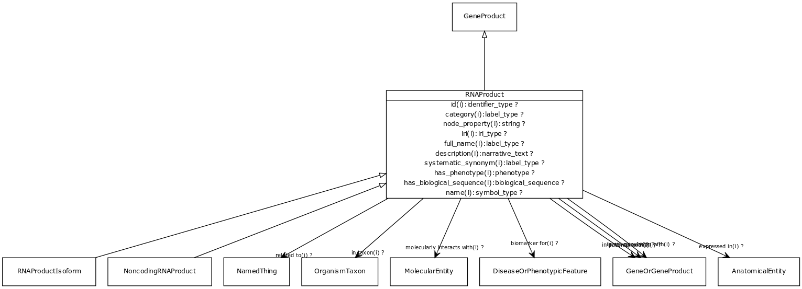

# Class: RNA product

URI: [http://bioentity.io/vocab/RnaProduct](http://bioentity.io/vocab/RnaProduct)

## Mappings

 * [CHEBI:33697](http://purl.obolibrary.org/obo/CHEBI_33697)
 * [SIO:010450](http://semanticscience.org/resource/SIO_010450)
 * [WD:Q11053](http://purl.obolibrary.org/obo/WD_Q11053)
## Inheritance

 *  is_a: [gene product](GeneProduct.md) - The functional molecular product of a single gene. Gene products are either proteins or functional RNA molecules
## Children

 *  child: [noncoding RNA product](NoncodingRnaProduct.md)
 *  child: [RNA product isoform](RnaProductIsoform.md) - Represents a protein that is a specific isoform of the canonical or reference RNA
## Used in

 *  class: [RNA product](RnaProduct.md) references: [RNA product isoform](RnaProductIsoform.md)
 *  class: [RNA product](RnaProduct.md) references: [noncoding RNA product](NoncodingRnaProduct.md)
 *  class: [RNA product](RnaProduct.md) references: [gene product](GeneProduct.md)
## Fields

 * _[related to](related_to.md)_
    * _A grouping for any relationship type that holds between any two things_
    * range: [named thing](NamedThing.md)
    * inherited from: [named thing](NamedThing.md)
 * _[molecularly interacts with](molecularly_interacts_with.md) *subsets: translator_minimal*_
    * range: [molecular entity](MolecularEntity.md)
    * inherited from: [molecular entity](MolecularEntity.md)
 * _[regulates, entity to entity](regulates_entity_to_entity.md) *subsets: translator_minimal*_
    * range: [molecular entity](MolecularEntity.md)
    * inherited from: [molecular entity](MolecularEntity.md)
 * _[biomarker for](biomarker_for.md) *subsets: translator_minimal*_
    * _holds between a measurable molecular entity and a disease or phenotypic feature, where the entity is used as an indicator of the presence or state of the disease or feature._
    * range: [disease or phenotypic feature](DiseaseOrPhenotypicFeature.md)
    * inherited from: [molecular entity](MolecularEntity.md)
 * _[in taxon](in_taxon.md) *subsets: translator_minimal*_
    * _connects a thing to a class representing a taxon_
    * range: [organism taxon](OrganismTaxon.md)
    * inherited from: [thing with taxon](ThingWithTaxon.md)
 * _[in pathway with](in_pathway_with.md) *subsets: translator_minimal*_
    * _holds between two genes or gene products that are part of in the same biological pathway_
    * range: [gene or gene product](GeneOrGeneProduct.md)
    * inherited from: [gene or gene product](GeneOrGeneProduct.md)
 * _[in complex with](in_complex_with.md) *subsets: translator_minimal*_
    * _holds between two genes or gene products that are part of (or code for products that are part of) in the same macromolecular complex_
    * range: [gene or gene product](GeneOrGeneProduct.md)
    * inherited from: [gene or gene product](GeneOrGeneProduct.md)
 * _[in cell population with](in_cell_population_with.md) *subsets: translator_minimal*_
    * _holds between two genes or gene products that are expressed in the same cell type or population _
    * range: [gene or gene product](GeneOrGeneProduct.md)
    * inherited from: [gene or gene product](GeneOrGeneProduct.md)
 * _[expressed in](expressed_in.md) *subsets: translator_minimal*_
    * _holds between a gene or gene product and an anatomical entity in which it is expressed_
    * range: [anatomical entity](AnatomicalEntity.md)
    * inherited from: [gene or gene product](GeneOrGeneProduct.md)
