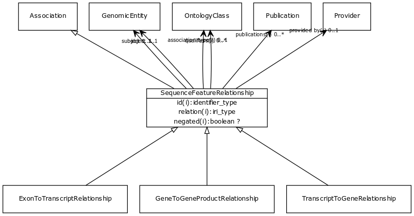

# Class: sequence feature relationship

For example, a particular exon is part of a particular transcript or gene

URI: [http://bioentity.io/vocab/SequenceFeatureRelationship](http://bioentity.io/vocab/SequenceFeatureRelationship)

## Mappings

 * [GMODChado:feature_relationship](http://purl.obolibrary.org/obo/GMODChado_feature_relationship)
## Inheritance

 *  is_a: [association](Association.md) - A typed association between two entities, supported by evidence
## Children

 *  child: [transcript to gene relationship](TranscriptToGeneRelationship.md) - A gene is a collection of transcripts
 *  child: [exon to transcript relationship](ExonToTranscriptRelationship.md) - A transcript is formed from multiple exons
 *  child: [gene to gene product relationship](GeneToGeneProductRelationship.md) - A gene is transcribed and potentially translated to a gene product
## Used in

 *  class: [sequence feature relationship](SequenceFeatureRelationship.md) references: [transcript to gene relationship](TranscriptToGeneRelationship.md)
 *  class: [sequence feature relationship](SequenceFeatureRelationship.md) references: [exon to transcript relationship](ExonToTranscriptRelationship.md)
 *  class: [sequence feature relationship](SequenceFeatureRelationship.md) references: [gene to gene product relationship](GeneToGeneProductRelationship.md)
## Fields

 * _[subject](subject.md)_
    * _connects an association to the subject of the association. For example, in a gene-to-phenotype association, the gene is subject and phenotype is object._
    * range: [genomic entity](GenomicEntity.md) [required]
    * __Local__
 * _[object](object.md)_
    * _connects an association to the object of the association. For example, in a gene-to-phenotype association, the gene is subject and phenotype is object._
    * range: [genomic entity](GenomicEntity.md) [required]
    * __Local__
 * _[related to](related_to.md)_
    * _A grouping for any relationship type that holds between any two things_
    * range: [named thing](NamedThing.md)
    * inherited from: [named thing](NamedThing.md)
 * _[association type](association_type.md)_
    * _connects an association to the type of association (e.g. gene to phenotype)_
    * range: [ontology class](OntologyClass.md)
    * inherited from: None
 * _[relation](relation.md)_
    * _the relationship type by which a subject is connected to an object in an association_
    * range: [relationship type](RelationshipType.md) [required]
    * inherited from: None
 * _[qualifiers](qualifiers.md)_
    * _connects an association to qualifiers that modify or qualify the meaning of that association_
    * range: [ontology class](OntologyClass.md)*
    * inherited from: None
 * _[publications](publications.md)_
    * _connects an association to publications supporting the association_
    * range: [publication](Publication.md)*
    * inherited from: None
 * _[provided by](provided_by.md)_
    * _connects an association to the agent (person, organization or group) that provided it_
    * range: [provider](Provider.md)
    * inherited from: None
